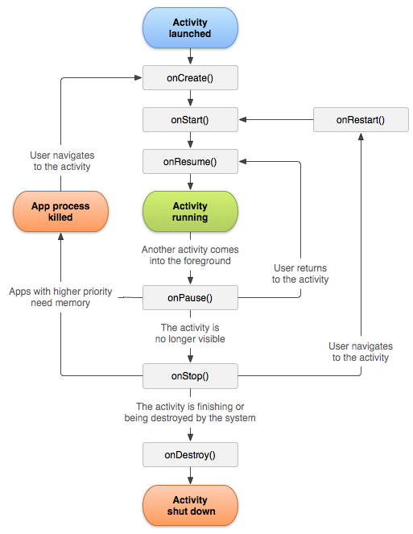

- Activity

  앱의 한 화면

- Life Cycle(주명 주기)

  onCreate

  → activity가 만들어질 때 단 한번만 호출된다.

  →activit를 만들 때 단 한번만 하면 되는 작업들을 여기에서 해준다.

  onStart

  onResume

  →다시 앱으로 돌아올때 무저곤 호출된다.

  →activity가 다시 호출될 때 하면 되는 작업들을 여기에서 해준다.

### 생명주기

생명주기 단계 간에 전환하기 위해 활동 클래스는 6가지 콜백으로 구성된 핵심 집합의

onCreate(), onStart(),onResume(),onStop(),onDestory()를 제공한다.

활동이 새로운 상태에 들어가면 시스템은 각 콜백을 호출한다.

사용자가 활동을 벗어나기 시작하면 시스템은 Activity를 해체할 메서드를 호출한다.

어떤 경우에는 부분적으로만 해체하기도 한다.

이때 Activity는 여전히 메모리 안에 남아있으며(예: 사용자가 다른 앱으로 전환할 경우)

포그라운드로 다시 돌아올 수 있다.

사용자가 해당 Activity으로 돌아오는 경우 사용자가 종료한 지점에서 Activity가 다시 시작된다.

몇가지 예외를 제외하고 앱은 백그라운드에서 실행될 때 Activity를 실행할 수 없다.

### 생명주기 콜백

**onCreate()**

시스템이 먼저 활동을 생성할 떄 실행되는것으로 필수적으로 구현해야 한다.

onCreate()메서드에서 활동의 전체 수명 주기 동안 한 번만 발생해야 하는 기본 애플리케이션 시작 로직을 실행한다.

(예  Activity를 ViewModel과 연결 일부 클래스범위 변수를 인스턴스화 )

이 메서드는 savedInstanceState매개변수를 수신하는데, 이는 활동의 이전 저장 상태가 포함된 Bundle객체이다. 이번 처음 생성된 활동인 경우 Bundle객체의 값은 null이다.

Activity는 생성됨 상태에 머무르지 않는다.

onCreate()메서드가 완료되면 created상태가 되고 시스템이

onStart()와 onResume()메서드를 호출한다.

**onStart()**

활동이 시작됨 상태에 들어가면 이 콜백 호출

Activity가 사용자에게 표시되고 , 앱은 활동을 포그라운드에 보내 상호작용할 수 있도록 준비한다.

활동이 시작됨 상태로 전환하면 이 활동의 수명 주기와 연결된 모든 수명 주기 인식 구성요소는 ON_START 이벤트를 수신한다.

onStart() 메서드는 매우 빠르게 완료되고 이 콜백이 완료되면 활동이 재개됨 상태에 들어가고 시스템이 onResume() 메서드를 호출한다.

**onResume()**

활동이 재개됨 상태에 들어가면 포그라운드에 표시되고 시스템이 onResume()콜백을 호출

이 상태에 들어갔을 때 앱이 사용자와 상호작용한다.

어떤 이벤트가 발생하여 앱에서 포커스가 떠날 떄까지 앱이 이상태에 머무른다.

(예를 들어 전화가 오거나 사용자가 다른 활동으로 이동하거나, 기기화면이 꺼지는 이벤트가 이에 해당된다.)

활동이 재개됨 상태로 전환되면 이 활동의 수명 주기와 연결된 모든 수명 주기 인식 구성요소는 ON_RESUME 이벤트를 수신합니다. 이 상태에서 수명 주기 구성요소가 포그라운드에서 사용자에게 보이는 동안 실행해야 하는 모든 기능을 활성화할 수 있습니다(예: 카메라 미리보기 시작).

방해되는 이벤트가 발생하면 활동은 일시중지됨 상태에 들어가고, 시스템이 onPause() 콜백을 호출한다.

활동이 일시중지됨 상태에서 재개도미 상태로 돌아오면 시스템이 onResume()메서드를 다시 한번 호출한다.

따라서 onResume()을 구현하여 onPause()중에 해제하는 구성요소를 초기화하고, 활동이 재개됨 상태로 전환될 때마다 필요한 다른 초기화 작업도 수행해야 한다.

**onPause()**

시스템은 사용자가 활동을 떠나는 것을 나타내는 첫 번째 신호로ㅓ 이 메서드를 호출

활동이 일시중지도미 상태로 전환하면 수명 주기와 연결도니 모든 수명주기 인식 구성요소는 ON_PAUSE 이벤트를 수신

여기에서 수명주기 구성요소는 구성요소가 포 그라운드에 있지 않을 때 실행할 필요가 없는 기능을 모두 정지할 수 있다.

**onStop()**

활동이 사용자에게 더 이상 표시되지 않으면 중단됨 상태에 들어가고, 시스템은 onStop()콜백을 호출

활동이 중단됨 상태로 전환하면 이 활동의 수명 주기와 연결된 모든 수명 주기 인식 구성요소는  ON_PAUSE 이벤트를 수신합니다. 여기에서 수명 주기 구성요소는 구성요소가 화면에 보이지 않을 때 실행할 필요가 없는 기능을 모두 정지할 수 있습니다.

onStop()메서드에서는 앱이 사용자에게 보이지 않는 동안 앱은 필요하지 않은 리소스를 해제하거나 조정해야 한다.

CPU를 비교적 많이 소모하는 종료 작업을 실행해야 한다.

**onDestroy()**

onDestroy()는 활동이 소멸되기 전에 호출된다. 시스템은 다음 중 하나에 해당할 때 이 콜백을 호출한다.

1. (사용자가 활동을 완전히 닫거나 활동에서 finish()가 호출되어) 활동이 종료되는 경우
2. 구성 변경(예: 기기 회전, 멀티 윈도우 모드)으로 인해 시스템이 일시적으로 활동을 소멸시키는 경우

활동이 소멸됨 상태로 전환하면 이 활동의 수명 주기와 연결된 모든 수명 주기 인식 구성요소는 ON_DESTROY 이벤트를 수신합니다. 여기서 수명 주기 구성요소는 활동이 소멸되기 전에 필요한 것을 정리할 수 있습니다.

활동에 소멸되는 이유를 결정하는 로직을 입력하는 대신 ViewModel 객체를 사용하여 활동의 관련 뷰 데이터를 포함해야 한다.

활동이 구성변경으로 인해 다시 생성될 경우 ViewModel은 그대로 보존되어 다음 활동 인스턴스에 전달되므로 추가 작업이 필요하지 않다.

활동이 다시 생성되지 않을 경우 ViewModel은 onCleared() 메서드를 호출하여 활동이 소멸되기 전에 모든 데이터를 정리해야 한다.

이와 같은 두 가지 시나리오는 isFinishing() 메서드로 구분할 수 있습니다.

활동이 종료되는 경우 onDestroy()는 활동이 수신하는 마지막 수명 주기 콜백이 됩니다. 구성 변경으로 인해 onDestroy()가 호출되는 경우 시스템이 즉시 새 활동 인스턴스를 생성한 다음, 새로운 구성에서 그 새로운 인스턴스에 관해 `[onCreate()](https://developer.android.com/reference/android/app/Activity#onCreate(android.os.Bundle))`를 호출합니다.

onDestroy()콜백은 이전의 콜백에서 아직 해제되지 않은 모든 리소스(예:onStop())를 해제해야 합니다.