## 객체 매핑하기

@Entity : JPA가 관리할 객체 → 엔티티라 한다.

@ID : DB PK와 매핑 할 필드

## 데이터베이스 방언

- JPA는 특정 데이터베이스에 종속적이지 않은 기술
- 각각의 데이터베이스가 제공하는 SQL 문법과 함수는 조금씩 다르다.
  - 가변 문자 : Mysql은 VARCHAR , Oracle은 VARCHAR2
  - 문자열을 자르는 함수 : SQL 표준은 SUBSTRING(), Oracle은 SUBSTR()
  - 페이징 : MySQL은 LIMIT, Oracle은 ROWNUM
- 방언 : SQL 표준을 지키지 않거나 특정 데이터 베이스만의 고유한 기능

## Dialect

• hibernate.dialect 속성에 지정
• H2 : org.hibernate.dialect.H2Dialect
• Oracle 10g : org.hibernate.dialect.Oracle10gDialect
• MySQL : org.hibernate.dialect.MySQL5InnoDBDialect
• 하이버네이트는 45가지 방언 지원
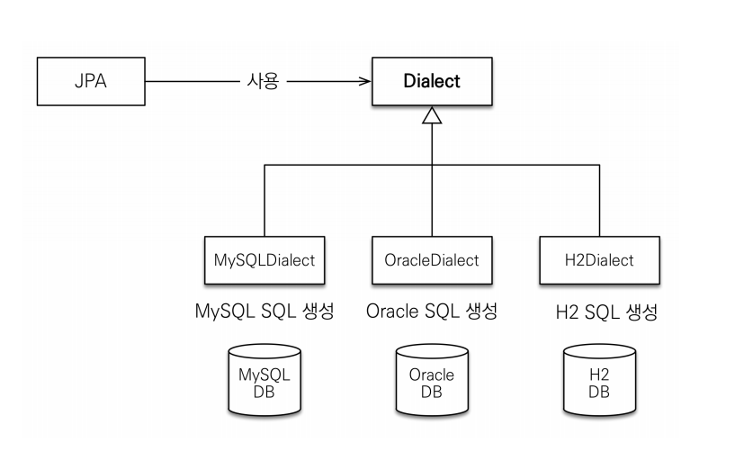

### JPA 구동 방식

1. Persistence라는 클래스를 먼저 생성한다.
2. 설정정보를 조회
3. EntityManagerFactory 라는 클래스 생성 → 필요할때마다 EntityManager를 생성한다.
   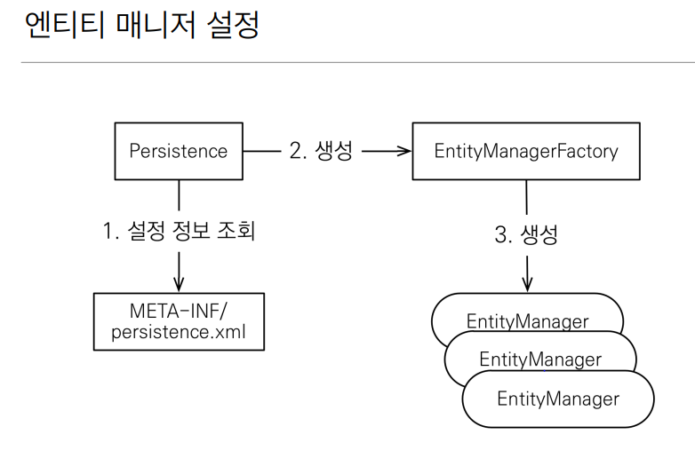

## 주의

- 엔티티매니저 팩토리는 하나만 생성해서 애플리케이션 전체에서 공유
- 엔티티매니저는 쓰레드간에 공유하면 안된다(사용하고 버려야한다).
- JPA의 모든 데이터 변경은 트랜잭션 안에서 실행

### 영속성 컨텍스트의 이점

- **1차 캐시**

  **엔티티 조회, 1차 캐시**
-
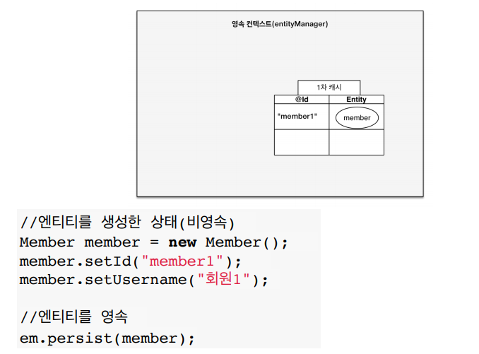

### 1차 캐시에서 조회

조회시 DB로 바로 접근하지 않고 먼저 1차 캐시에서 조회

1차 캐시는 글로벌 캐시가 아니다. (스레드 하나 시작하고 끝날때 까지 잠깐 사용)

서로 공유하지 않는 캐시

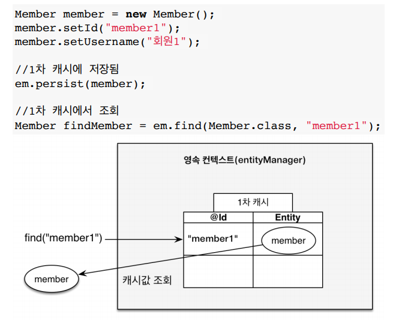

### 데이터베이스에서 조회

1차 캐시에서 존재하지 않는 경우에는 DB에서 조회 하여 1차 캐시에 저장 한뒤 반환

- **동일성(identity) 보장**

  == 비교시 true를 반환해 준다. (1차 캐시에서 반환되기 때문에)
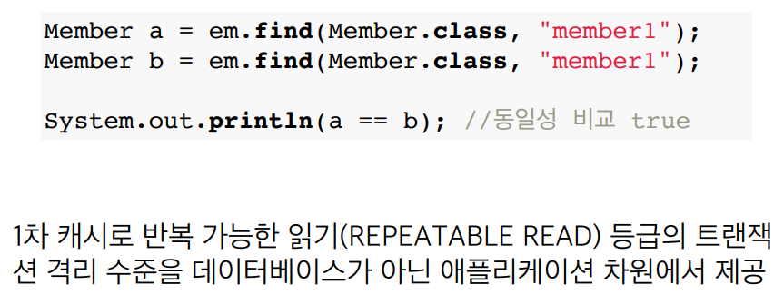

  - **트랜잭션을 지원하는 쓰기 지연(transactional write-behind)**

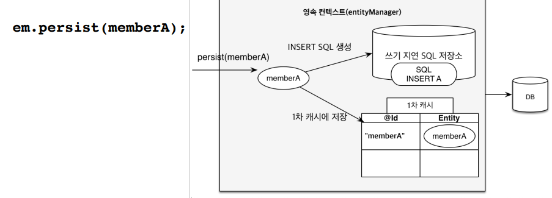
  memberA를 1차캐시에 저장 한뒤 INSERT SQL를 미리 뽑아놓는다. DB에는 접근하지 않음

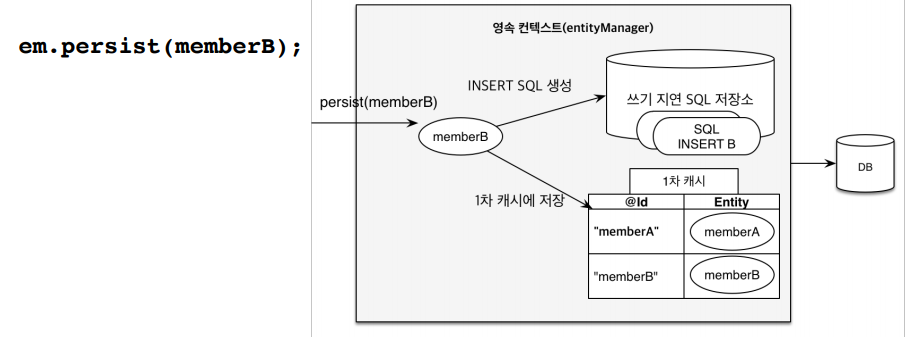

  memberB 또한 1차캐시에 저장 한뒤 INSERT SQL를 미리 뽑아놓는다. DB에는 접근하지 않음
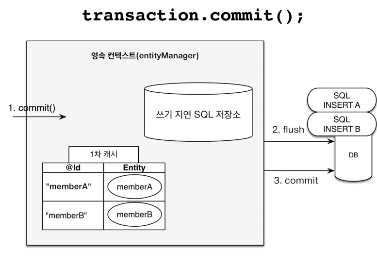

  **commit 시에 쓰기 지연 SQL저장소에 있던 쿼리들이 동시에 DB에 보내진다.**
- (동시에 보낼수도 하나씩 보낼 수도 있다 그것은 옵션으로 설정 가능)

  **보내는 과정을 flush()** 라고 한다.

  - **엔티티 수정 / 변경 감지(Dirry Checking)**

    영속 엔티티를 조회한 후 수정하면 자동으로 변경을 감지하고 update query가 나간다.
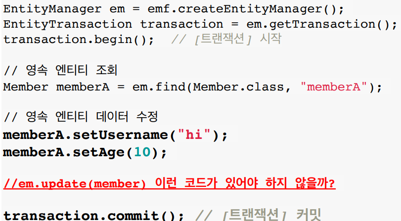

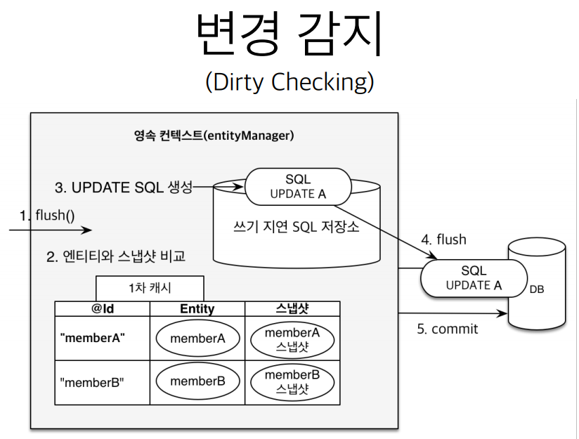
  JPA는 트랜잭션이 1차 캐시가 생성되는 시점에 스냅샷을 떠둔다.

  JPA를 commit이나flush하는 시점에 스냅샷과 비교를 한 후 변경된 것들에 대해 update 쿼리를 만들어 DB에 보낸다.

  ### 엔티티 삭제

  삭제 대상 엔티티를 조회 한후 remove 하면 트랜잭션 커밋 시점에 삭제된다

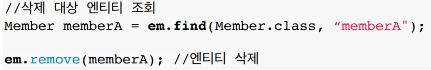
  
### 플러시 → 영속성 컨텍스트의 변경내용을 데이터베이스에 반영한다.

- 변경감지
- 수정된 엔티티 쓰기 지연 SQL 저장소에 등록
- 쓰기 지연 SQL 저장소의 쿼리를 데이터베이스에 전송

  (등록,수정,삭제 쿼리)

  ### 영속성 컨텍스트를 플러시 하는 방법
  
- em.flush()
- 트랜잭션 커밋
      
    플러시 자동 호출
      
- JPQL 쿼리 실행
      
    플러시자동 호출 
      
  
  **플러시를 해도 1차캐시는 유지된다.**
  
  **JPQL 쿼리를 실행하면 플러시가 자동으로 호출된다.**
  
  ### 플러시 모드 옵션
  
- FlushModeType.AUTO
커밋이나 쿼리를 실행할 때 플러시 (기본값)
- FlushModeType.COMMIT
      
    커밋할 때만 플러시
      
  
  ### 플러시는!
  
- 영속성 컨텍스트를 비우지 않음
- 영속성 컨텍스트의 변경내용을 데이터베이스에 동기화
- 트랜잭션이라는 작업 단위가 중요 → 커밋 직전에만 동기화 하면 된다.
  
  ### 준영속 상태
  
- 영속 → 준영속
- 영속 상태의 엔티티가 영속성 컨텍스트에서 분리(detached)
- 영속성 컨텍스트가 제공하는 기능을 사용 못함
  
  ### 준영속 상태로 만드는 방법
  
- em.detach(entity)
      
    특정 엔티티만 준영속 상태로 전환
      
- em.clear()
      
    영속성 컨텍스트를 완전히 초기화
      
- em.close()
      
    영속성 컨텍스트를 종료

