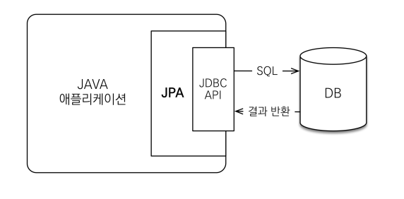
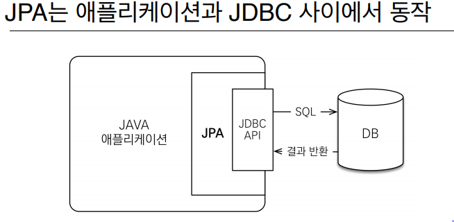
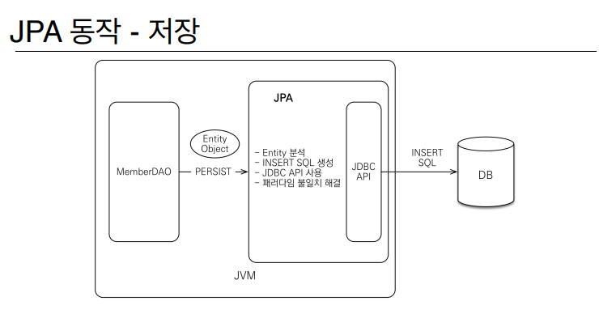
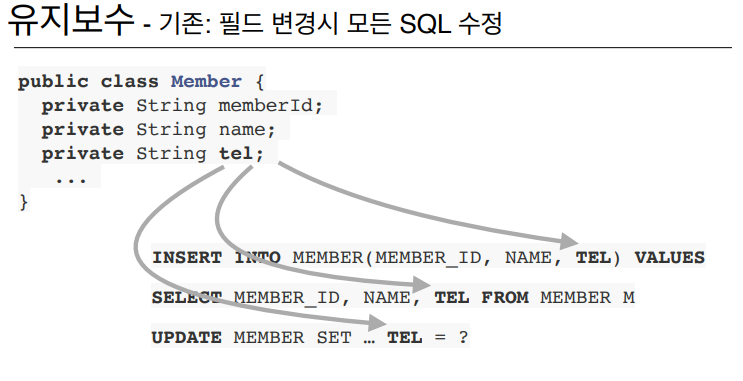
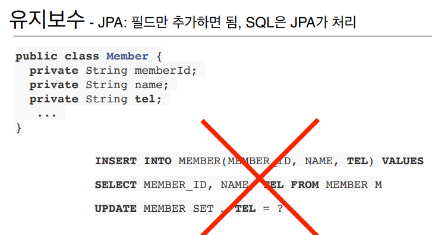
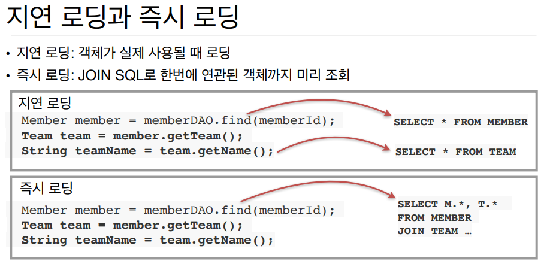

### 계층형 아키텍처

진정한 의미의 계층 분할이 어렵다

### SQL에 의존적인 개발을 피하기 어렵다.

### 패러다임의 불일치

객체 vs 관계형 데이터베이스

관계는 어떻게 관계를 맺어 잘 저장할까

어떻게 해서 추상화하고 관리를 잘할까

관점이 다르다. 사상 자체가 다름

### 객체답게 모델링 할수록 매핑 작업만 늘어난다.

### 객체를 자바 컬렉션에 저장하듯이 DB에 저장할 수 없을까?

→ JPA

### Java Persistence API - JPA

persistence(영구저장 영원히 저장하는)

### ORM?

Object-relational mapping(객체 관계 매핑)

- 객체는 객체대로 설계
- 관계형 데이터베이스는 관계형 데이터베이스대로 설계
- ORM 프레임워크가 중간에서 매핑
- 대중적인 언어에는 대부분 ORM 기술이 존재

### JPA는 애플리케이션과 JDBC 사이에서 동작

### 📌 가장중요! 패러다임의 불일치를 해결

### 📌 JPA를 왜 사용해야 하는가?

- SQL 중심적인 개발에서 객체 중심으로 개발
- 생산성

  저장 : jpa.periss(member)

  조회 : Member member = jpa.find(memberId)

  수정 : member.setName("변경할 이름")

  삭제 : jpa.remove(member)

- 유지보수

- 패러다임의 불일치 해결
- 성능
    - 1차 캐시와 동일성(identity) 보장

      → 동일한 트랜잭션에서 조회한 엔티티는 같음(약간의 조회 성능 향상)

    - 트랜잭션을 지원하는 쓰기 지연(transactional write-behind)
        1. 트랜잭션을 커밋할 때까지 INSERT SQL을 모음
        2. JDBC BATCH SQL 기능을 사용해서 한번에 SQL 사용
    - 지연 로딩(Lazy Loading)

- 데이터 접근 추상화와 벤더 독립성
- 표준
