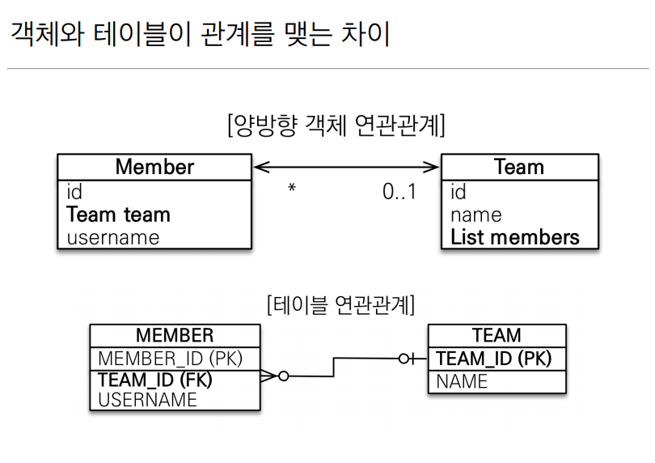
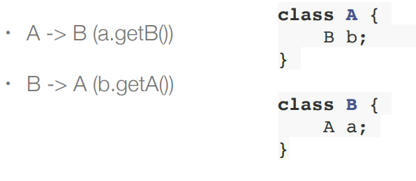
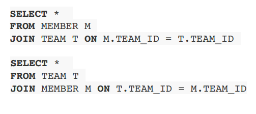
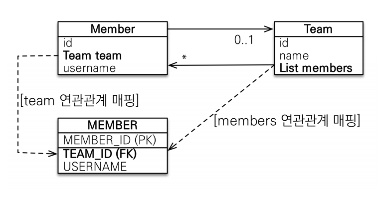
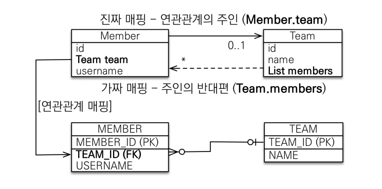
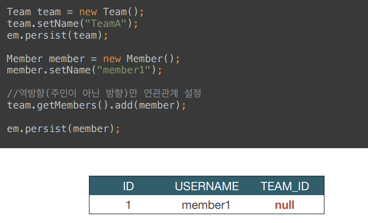
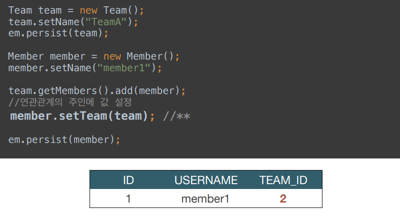

### 양방향 매핑(반대 방향으로 객체 그래프 탐색)

객체와 테이블간에 연관관계를 맺는 차이를 이해해야한다.

### 객체와 테이블이 관계를 맺는 차이

**객체 연관관계**

- 회원 → 팀 연관관계 1개(단방향)
- 팀 → 회원 연관관계 1개 (단방향

**테이블 연관관계**

- 회원 ↔ 팀의 연관관계 1개 (양방향)

### 객체의 양방향 관계

- 객체의 양방향 관계는 사실 양방향 관계가 아니라 서로 다른 단방향 관계 2개이다.
- 객체를 양방향으로 참조하려면 단방향 연관관계를 2개 만들어야 한다.

### 테이블의 양방향 연관관계

- 테이블은 외래 키 하나로 두 테이블의 연관관계를 관리
- MEMBER.TEAM_ID 외래 키 하나로 양방향 연관관계 가짐

  (양쪽으로 조인할 수 있다)

**둘 중 하나로 외래 키를 관리해야 한다.**

### 연관관계의 주인(Owner)

**양방향 매핑 규칙**

- 객체의 두 관계중 하나를 연관관계의 주인으로 지정
- **연관관계의 주인만이 외래키를 관리(등록,수정)**
- **주인이 아닌쪽은 읽기만 가능**
- 주인은 mappeBy속성 사용 X
- 주인이 아니면 mappedBy속성으로 주인 지정

### 📌누구를 주인으로?

**외래 키가 있는 곳을 주인으로 정해라.**

여기서는 Member.team이 연관관계의 주인

**양방향 매핑시 가장많이 하는 실수 → 연관관계의 주인에 값을 입력하지 않음**

**양방향 매핑시 연관관계의 주인에 값을 입력해야 한다.**

(순수한 객체 관계를 고려하면 항상 양쪽다 값을 입력해야 한다.)

### 양방향 매핑의 장점

- **단방향 매핑만으로도 이미 연관관계매핑은 완료**
- 양방향 매핑은 반대 방향으로 조회(객체 그래프 탐색) 기능이 추가된 것 뿐
- JPQL에서 역방향으로 탐색할 일이 많음
- 단방향 매핑을 잘 하고 양방향은 필요할 때 추가해도 됨

  (테이블에 영향을 주지 않는다)