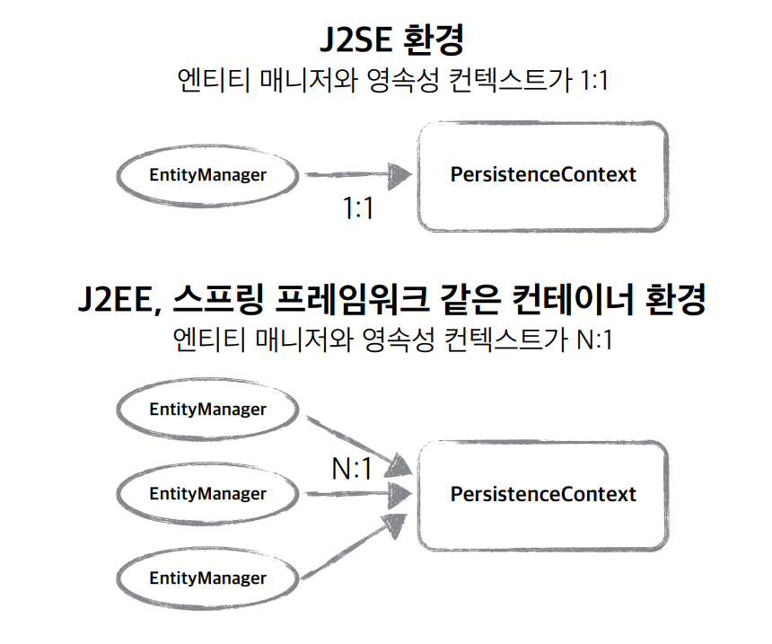

### 영속성 컨텍스트

- JPA를 이해하는데 가장 중요한 용어
- 엔티티를 영구 저장하는 환경 이라는 뜻
- EntityManager.persist(entity); → DB에 저장한다는 것이 아닌 Entity를 영속성 컨텍스트에 저장한다는것.

> 영속성 컨텍스트는 논리적인 개념
눈에 보이지 않는다.
엔티티 매니저를 통해서 영속성 컨텍스트에 접근
>

### 엔티티의 생명주기

- **비영속(new/transient)**

  영속성 컨텍스트와 전혀 관계가 없는 새로운 상태 (새로운 객체만 생성해놓은 상태)

- **영속(managed)**

  영속성 컨텍스트에 관리되는 상태

- **준영속(detached)**

  영속성 컨텍스트에 저장되었다가 분리된 상태

- **삭제(removed)**

  삭제된 상태

### 영속성 컨텍스트의 이점

- 1차 캐시
- 동일성(identity) 보장
- 트랜잭션을 지원하는 쓰기 지연

  (transactional write-behind)

- 변경 감지(Dirty Checking)
- 지연로딩(Lazy Loading)