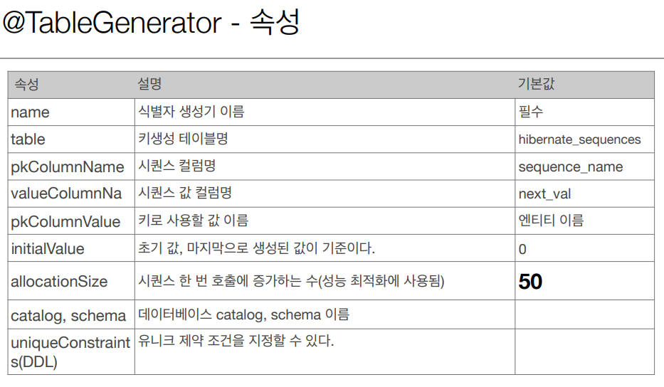

## 데이터베이스 스키마 자동 생성하기

- DDL을 애플리케이션 실행 시점에 자동 생성
- 테이블 중심 → 객체 중심
- 데이터 베이스방언을 활용해서 데이터베이스에 맞는 적절한 DDL 생성

  이렇게 **생성된 DDL은 개발 장비에서만 사용**

- 생성된 DDL은 운영서버에서 사용하지 않거나, 적절히 다듬은 후 사용

[hibernate.hbm2ddl.auto](http://hibernate.hbm2ddl.auto) 옵션

- create : 기존테이블 삭제 후 다시 생성 (DROP + CREATE)
- create-drop : create와 같으나 종료시점에 테이블 DROP
- update : 변경분만 반영 ( 운영DB에는 사용하면 안됨)
- vaildate : 엔티티와 테이블이 정상 매핑되었는지만 확인
- none : 사용하지 않음

- **운영 장비에는 절대 create, create-drop,update 사용하면 안됨**
- 개발 초기 단계는 create 또는 update
- 테스트 서버는 update 또는 validate
- 스테이징과 운영서버는 validate 또는 none

## 매핑 어노테이션

### @Column(name = "") : DB의 "" 안에 들어간 이름이 DB의 컬럼이름과 매핑

가장 많이 사용되는 것들

name : 필드와 매핑할 테이블의 컬럼 이름

insertable, updateable : 등록, 변경가능 여부

nullable: null 허용여부 결정, DDL 생성시 사용 false로 설정하면 DDL 생성시에 not null 제약조건이 붙는다.

unique: 유니크 제약 조건, DDL 생성시 사용

(잘 사용하지 않는다 유니크 이름이 랜덤으로 들어가 식별하기 어렵고 단일 컬럼에만 걸 수 있다.)

(대신 이름까지 지정할 수 있는 테이블 자체에 @Table(uniqueConstraints = "") 방식을 사용한다. )

columnDefintion(DDL) : 데이터베이스 컬럼 정보를 직접 줄 수 있다.

length(DDL): 문자 길이 제약조건, String 타입에만 사용한다.

precision, scale(DDL) : BigDecimal 타입에서 사용한다.(BigInteger도 사용할 수 있다.)

precision은 소수점을 포함한 전체 자릿수를 scale은 소수의 자리수다.

참고로 double, float타입에는 적용되지 않는다. 아주 큰 숫자나 정밀한 소수를 다루어야 할 때만 사용한다.

**@Temporal : 시간 데이터 지원**

@Temporal(TemporalType.DATE)
private Date date; //날짜
@Temporal(TemporalType.TIME)
private Date time; //시간
@Temporal(TemporalType.TIMESTAMP)
private Date timestamp; //날짜와 시간

### @Enumerated : enum타입을 매핑

@Enumerated(EnumType.STRING)

실무에서는 무조건 STRING을 사용

original은 순서가 들어감 (숫자) 절대 사용 X

**@Lob**

컨텐츠 길이가 너무 길면 바이너리 파일로 DB에밀어넣을때 사용

- CLOB,BLOB 매핑

  CLOB는 Charater형 긴 단어

  BLOB Byte 형

  CLOB : String, char[], java.sql.CLOB
  BLOB : byte[], java.sql.BLOB

  String에 사용하면 CLOB
  @Lob
  private String lobString;

  byte에 사용하면 BLOB
  @Lob
  private byte[] lobByte;

### @Transient

- 이 필드는 매핑하지 않는다.
- 애플리케이션에서 DB에 저장하지 않는 필드

## 기본키 매핑 어노테이션

### @Id(직접 매핑)

- 자동생성(@GeneratedValue)
    - IDENTITY : 기본키 생성을 데이터베이스에 위임, MYSQL
        - 주로 MySQL,PostgreSQL,SQL Server,DB2에서 사용
        - JPA는 보통 트랜잭션 커밋 시점에 INSERT SQL 실행
        - AUTO_INCREMENT는 데이터베이스에 INSERT SQL을 실행 한 이후에 ID 값을 알 수 있음.
        - IDENTITY 전략은 em.persist() 시점에 즉시 INSERT SQL 실행하고 DB에서 식별자를 조회
    - SEQUENCE : 데이터베이스 시퀀스 오브젝트 사용, ORACLE

      @SequenceGenerator → 주의 :  allocationSize 기본값 = 50

        - name  : 식별자 생성기 이름 (필수)
        - sequenceName : 데이터베이스에 등록되어 있는 시퀀스 이름

          기본값 = hibernate_sequence

        - initialValue : DDL 생성 시에만 사용됨, 시퀀스 DDL을 생성할 때 처음 1 시작하는 수를 지정한다.
        - allocationSize : 시퀀스 한 번 호출에 증가하는 수 (성능 최적화에 사용됨
          데이터베이스 시퀀스 값이 하나씩 증가하도록 설정되어 있으면 이 값을 반드시 1로 설정해야 한다.)
        - catalog,schema : 데이터베이스 catalog,schema 이름
    - TABLE : 키 생성용 테이블을 하나 만들어서 테이터베이스 시퀀스를 흉내내는 전략

      장점 : 모든 데이터베이스에 적용 가능

      단점 : 성능

      @TableGenertator 필요

      
    - AUTO : DB방언에 따라 자동 지정, 기본값

### 권장하는 식별자 전략

- 기본 키 제약 조건 : null이 아님, 유일 , **변하면 안된다.**
- 미래까지 이 조건을 만족하는 자연키는 찾기 어렵다. 대리키(대체키)를 사용하자.
- 예를 들어 주민등록번호도 기본 키로 적절하지 않다.
- **권장 : Long + 대체키 + 키 생성전략 사용**

### allocationSize

저장을할때마다 nextcall로 가져오면 네트워크를 탄다 → 성능문제 야기

allocationSize = 50 으로 지정했다고 가정하면 미리 50개의 사이즈를 미리 올린후 메모리에서 1씩 사용 하다 다 사용하면 다시 nextCall해서 50개를 더 올린다.

→ DB에 미리 올려놓고 메모리에서 올려놓은 개수만큼 사용하는 방식

여러 웹서버가 있어도 동시성 이슈없이 다양한 이슈 해결 가능

너무 크게 설정시 웹서버를 내리는 시점에 구멍이 생김 (상관은 없지만 낭비가 생김) 50 이나 100이 적절