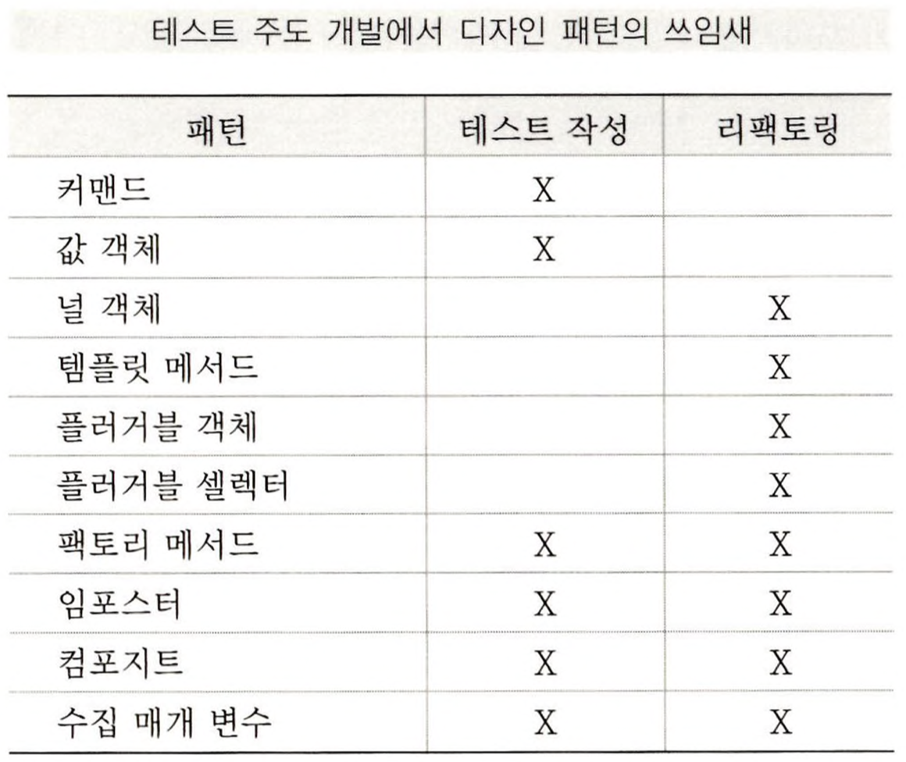

### 테스트 주도 개발(TDD)의 리듬

1. 재빨리 테스트를 하나 추가한다.
2. 모든 테스트를 실행하고 새로 추가한 것이 실패하는지 확인한다.
3. 코드를 조금 바꾼다.
4. 모든 테스트를 실행하고 전부 성공하는지 확인한다.
5. 리팩토링을 통해 중복을 제거한다.

**당신은 다음과 같은 것에 대해 놀랄 것이다.**

- 각각의 테스트가 기능의 작은 증가분을 어떻게 커버하는지
- 새 테스트를 톨아가게 하기 위해 얼마나 작고 못생긴 변화가 가능한지.
- 얼마나 자주 테스트를 실행하는지.
- 얼마나 수 없이 작은 단계를 통해 리팩토링이 되어가는지.

앞으로 어떤 일을 해야하는지 알려 주고 지금 하는일에 집중 할 수 있도록 도와주며, 언제 일이 다 끝나는지 알려줄 수 있게끔 할일 목록을 완성해보자.

앞으로 할일 목록에 있는 한 항목에 대한 작업을 시작하면 그 항목을 **이런 식으로** 굵은 글씨체로 나타낼 것이다. 작업을 끝낸 항목에는 ~~이런 식으로~~ 줄을 긋도록하자.

또 다른 테스트가 생각나면 할일 목록에 새로운 항목을 추가 할 것이다.

**객체를 만들면서 시작하는 것이 아니라 테스트를 먼저 만들어야 한다.**

### 테스트 주기

1. 작은 테스트를 하나 추가한다.
2. 모든 테스트를 실행해서 테스트가 실해하는 것은 확인한다.
3. 조금 수정한다.
4. 모든 테스트를 실행해서 테스트가 성공하는 것을 확인한다.
5. 중복을 제거하기 위해 리팩토링을 한다.

### 의존성과 중복

스티브 프리만은 테스트와 코드간의 문제는 중복이 아님을 지적한 바 있다.

문제는 테스트와 코드 사이에 존재하는 의존성이다.

즉. 코드나 테스트 중 한쪽을 수정하면 반드시 다른 한쪽도 수정해야만 한다는 것이다.

우리의 목표는 코드를 바꾸지 않으면서도 뭔가 의미있는 테스트를 하나 더 작성하는 것인데 현재의 구현으로는 불가능 하다.

의존성(dependendy)는 소프트웨어 개발의 모든 부분에서 핵심적인 문제다.

만약 특정 데이터베이스 벤더가 제공하는 세세ㅏㄴ 기능들을 코드 여기저기에서 사용하는 사오항에서 데이터베이스를 다른 벤더의 제품으로 변경하고자 한다면 코드가 해당 벤더에 대해 의존성을 갖는다는 사실을 알 게 될것이다. 코드를 변경하지 않고는 벤더를 바꿀 수 없다.

의존성이 문제 그 자체라면 중복(duplication)은 문제으 징후다. 중복의 가장 흔한 예는 로직의 중복이다.

중복된 로직이란 동일한 문장이 코드의 여러 장소에 나타나는 것을 의미한다. 중복된 로직을 하나로 끄집어내는 일엔 객체를 이용하는 것이 최고다.

**문제 자체는 남겨둔 체로 징후만을 제거하면 다른 어딘가에서 최악의 형태로 문제가 드러나곤 하는 현실 세계의 일반적인 양상과는 달리 프로그램에서는 중복만 제거해주면 의존성도 제거된다.**

**이게 바로  TDD의 두 번째 규칙이 존재하는 이유다.**

**다음 테스트로 진행하기 전에 중복을 제거함으로써 오직 한 가지(only and only one)의 코드 수정을 통해 다음 테스트도 통과되게 만들 가능성을 최대화 하는 것이다.**


### 2장 

일반적인 TDD 주기는 다음과 같다.

1. 테스트를 작성한다. 마음속에있는 오퍼레이션 코드에 어떤 식으로 나타나길 원하는지 생각해보라.

   이야기를 써내려가는 것이다. 원하는 인터페이스를 개발하라. 올바른 답을 얻기위해 필요한 이야기의 모든 요소를 포함시켜라.

2. 실행 가능하게 만든다. 다른 무엇보다도 중요한 것은 빨리 초록 막대를 보는 것이다. 깔끔하고 단순한 해법이 명백히 보인다면 그것을 입력하라. 만약 깔끔하고 단순한 해법이 있지만 구현하는 데 몇 분 정도 거릴ㄹ것 같으면 일단 적어 놓은 뒤에 원래 문제(초록 막대를 보는 것)로 돌아오자.
   미적인 문제에 대한 이러한 전환은 몇몇 숙련된 소프트웨어 공학자들에게는 어려운 일이다.
   그들은 오로지 좋은 공학적 규칙들을 따르는 방법만 알 뿐이다. 빨리 초록 막대를 보는 것은 모든 죄를 사해준다. 하지만 아주 잠시 동안만이다.
3. 올바르게 만든다.이제 시스템이 작동하므로 직전에 저질렀던 죄악을 수습하자. 좁고 올곧은 소프트웨어 정의(software righteousness)의 길로 되돌아와서 종복을 제거하고 초록 막대로 되돌리자.

우리 목적은 작동하는 깔끔한 코드는 얻는 것.

작동하는 깔끔한 코드를 얻는것은 때로는 최고의 프로그래머들조차 도달하기 힘든 목표고,

대부분의 평범한 프로그래머들에게는 거의 불가능한 일이다. 그렇다면 나누어서 정복하자(divide and conquer)

일단 '작동하는 깔끔한  코드'를 얻어야 한다는 전체 문제 중에서 '작동하는'에 해당하는 부분을 먼저 해결하라.

그러고 나서 '깔끔한 코드' 부분을 해결하는 것이다. 이러한 접근 방식은 '깔끔한 코드' 부분을 먼저 해결한 후에, '작동하는' 부분을 해결해 가면서 배운것들을 설계에 반영하느라 허둥거리는 아키텍처 주도 개발(archi-tecture-driven development)과 정반대다.

### 최대한 빨리 초록색을 보기 위해 취할 수 있는 전략 2가지

- 가짜로 구현하기 : 상수를 반환하게 만들고 진짜 코드를 얻을 때까지 단계적으로 상수를 변수로 바꾸어 간다.
- 명백한 구현 사용하기 : 실제 구현을 입력한다.

예상치 못한 빨간 막대를 만나게 되면 뒤로 한발 물러서서 가짜로 구현하기 방법은 사용하면서 올바른 코드로 리팩토링한다.


### 3장 
객체를 값처럼 쓸 수 있는데 이것은 **값 객체 패턴 (value object pattern)**이라고 한다.

값 객체에 대한 제약사항중 하나는 객체의 인스턴스 변수가 생성자를 통해서 일단 설정된 후에는 결코 변하지 않는다는 것.

값 객체를 사용하면 별칭 문제를 걱정할 필요가 없다는 아주 큰 장점이 있다.

값 객체가 암시하는 것 중 하나는 2장에서와 같이 모든 연산은 새 객체를 반환해야 한다는 것.

또다른 암시는 값 객체는 equals()를 구현해야 한다는 것인데, 왜냐하면 5$라는 것은 다른 5$만큼이나 똑같이 좋은 것이기 때문이다.

### 5장
우리 주기에는 서로다른 단계들이 있다.

1. 테스트 작성
2. 컴파일되게 하기.
3. 실패하는지 확인하기위해 확인
4. 실행하게 만듦
5. 중복 제거

각 단계에는 서로 다른 목적이 있다. 다른 스타일의 해법, 다른 미적 시각을 필요로 한다.

처음 네 단계는 빨리 진행해야 한다. 그러면 새 기능이 포함되더라도 잘 알고 있는 상태에 이를 수 있다. 거기에 도달하기 위해서라면 어떤 죄든 저지를 수 있다. 그동안 만큼은 속도가 설계보다 더 높은 패 이기 때문이다.

주기의 다섯 번째 단계 없이는 앞의 네 단계도 제대로 되지 않는다. 적절한 시기에 적절한 설계를 돌아가게 만들고 올바르게 만들어라.

### 6장
중복을 처리하는 방법

클래스중 하나가 다른 클래스를 상속받게 하는 것.

두 클래스의 공통 상위 클래스를 찾아 낸다.

적절한 테스트를 갖지 못한 코드에서 TDD를 해야하는 경우가 종종 있을 것이다.

충분한 테스트가 없다면 지원 테스트가 갖춰지지 않은 리팩토링을 만나게 될 수 밖에 없다.

리팩토링 하면서 실수했는데도 불구하고 테스트가 여전히 통과할 수도 있는 것이다. 어떻게 할 것인가?

있으면 좋을 것 같은 테스트를 작성하라.그렇게 하지 않으면 결국에는 리팩토링하다 뭔가 깨트릴 것이다.  리팩토링 하기 전에 테스팅을 하자.

### 8장
하위 클래스에 대한 직접적인 참조가 적어진다면 하위 클래스를 제거하기 위해 한발짝 더 다가섰다고 할 수 있다.

하위클래스의 존재를 테스트에서 분리(decoupling)함으로써 어떤 모델 코드에도 영향을 주지 않고 상속 구조를 마음대로 변경할 수 있게 된다.

### 13장
클래스를 명시적으로 검사하는 코드가 있을 때에는 항상 다형성을 사용하도록 바꾸는 것이 좋다.


### 작성한 테스트에 대한 지표

- 명령문 커버리지(statement coverage)는 테스트의 질에 대한 충분한 평가 기준이 될 수 없음이 확실하지만, 테스트의 시작점이다. TDD는 100%의 명령문 커버리지를 종교적으로 따른다. JProbe(www.sitraka.com/software/jprobe)는 오직 한 메서드의  단 한줄(Money.toString())만이 테스트 케이스에 의해 검증되지 않는다고 보고하는데, 이 메서드는 실제 모델코드를 위해서 작성한 것이 아니라 디버깅을 위해 작성한 것이다.
- 결함 삽입(defect insertion)은 테스트의 질을 평가하는 또 다른 방법이다.
  원리는 간단하다. 코드의 의미를 바꾼 후에 테스트가 실패하는지 보는 것이다.
  이 작업은 수동으로 할 수도 있지만 Jester(jester.sourceforge.net) 같은 툴을 사용할 수도 있다.
  Jester는 내용을 변경해도 테스트가 실패하지 않는 단 한줄(Pair.hashCode())의 토드가 있다고 보고하는데, 무조건 0을 반환하도록 한 곳이다. 0대신 다른 상수를 반환하도록 해도 실제로 프로그램의 의미가 변하지 않음으므로 Jester가 삽입한 것을 실제로 결함(defect)이라고 볼 수는 없다.

이책의 리뷰어중 한 사람인 플립(Phlip)이 테스트 커버리지에 대해 한 이야기가 있는데 여기서 되풀이할 가치가 있다.
전체 커버리지 수치는 프로그램의 서로 다른 경우를 테스트하는 테스트수를 테스팅이 필요한 경우의수( 로직의 복잡도)로 나눈 것이다.
테스트 커버리지를 향상시키는 한가지 방법은 더 많은 테스트를 작성하는 건데, 테스트 주도 개발자가 작성하는 테스트 코드의 수와 전문 테스터가 작성하는 테스트 코드의 수 사이의 엄청난 차이가 여기에서 온다.

또 다른 방법은 테스트의 수는 그대로 두면서 프로그램의 로직을 단순화하는 것이다.
리팩토링 단계가 종종 다음과 같은 효과를 가져온다.
조건문이 메시징으로 바뀌거나 아예 사라진다. 플립의 말을 빌자면 "모든 입력의 경우(좀더 정확히 말하자면 가능한 모든 경우를 효율적으로 줄인 샘플)를 따져서 테스트 커버리지를 높이는 대신에 우리는 테스트는 그대로 두고 코드를 줄여서 테스트가 다양한 경우를 다루게 한다.


### 테스트 주도 개발 패턴
### 테스트(명사)

테스트하다(test)는 '평가하다 라는 뜻의 동사다.

양성 피드백 고리

스트레스를 많이 받으면 테스트를 점점 더 뜸하게 한다.

테스트를 뜸하게 하면 당신이 만드는 에러는 점점 많아질 것이다.

에러가 많아지면 더 많은 스트레스를 받게 된다.

씻어내고 다시 반복하라(rinse and repeat)

### 격리된 테스트

테스트를 실행하는 것이 서로 어떤 식으로 영향을 미쳐야 좋은가? 아무 영향이 없어야 한다.

교훈

테스트가 충분히 빨라서 내가 직접, 자주 실행할 수 있게끔 만들자는 것.

→ 내가만든 에러를 다른 누구보다 먼저 내가 잡을 수 있고, 더 이상 악몽같은 아침도 없을 거다.

어마어마한 양의 종이더미가 반드시 어마어마한 양의 문제를 의미하는 것은 아니라는 점이다.

앞 부분에서 실행된 테스트가 실패한 후 그영향으로 다음 테스트부터는 시스템이 예측불가능한 상태에 놓이는 경우가 허다하다.

테스트는 전체 애플리케이션을 대상으로 하는 것보다 좀더 작은 스케일로 하는 게 좋다는 것.

주된 교훈은 각각의 테스트는 다른 테스트와 완전히 독립적 이어야한다.

즉. 문제가 하나면 테스트도 하나만 실패해야하고 문제가 둘이면 테스트도 두 개만 실패해야 한다.

성능 문제는 테스트가 데이터를 공유해야 하는 이유로 자주 언급된다.

주어진 문제를 작은 단위로 분리하기 위해 노력해서 각 테스트를 실행하기 위한 환경을 쉽고 빠르게 세팅할 수 있게 해야 한다는 것이다.

테스트를 격리하기 위한 작업은 결과적으로 시스템이 응집도는 높고 결합도는 낮은 객체의 모음으로 구성되도록 한다.

### 테스트 목록

시작하기 전에 작성해야할 테스트 목록을 모두 적어둘 것.

새로운 항목이 나타나면 나는 빠르고 의식적으로 이 항목이 '지금'할일에 속하는지 '나중에' 할일에 속하는지, 또는 할 필요가 없는 일인지를 결정한다.

이를 테스트 주도 개발에 적용하면  구현해야할 것들에 대한 테스트를 목록에 적는다.

우선 구현할 필요가 있는 모든 오퍼레이션의 사용예들을 적는다.

그 다음, 이미 존재하지 않는 오퍼레이션에 대해서는 해당 오퍼레이션의 널 버전(아무 일도 하지 않는 버전) 을 리스트에 적는다. 마지막으로 깔끔한 코드를 얻기위해 이번 작업을 끝내기 전에 반드시 해야할 리팩토링 목록을 적는다.

테스트를 한번에 다 만들어 놓는 방법이 먹히지 않았던 두 가지 이유

첫째 만들어진 모든 테스트는 리팩토링에 대한 약간의 관성을 갖는다.
자동화된 리팩토링 도구 (예를 들어 변수의 선언부와 모든 참조를 찾아서 한번에 이름 바꾸기를 수행해 주는 메뉴 항목 같은 것) 가 있다면 이것은 별 문제가 안 된다. 그렇지 않다면 열 개의 테스트를 만들 후에 매개 변수의 순서를 반대로 하는 게 좋을 거라는 사실을 발견하더라도 여러분은 아마 이 순서를 바꾸지 않으려 할 것이다.

둘째

열개의 테스트가 실패했다면 초록 막대를 보는 것은 한참 멀었다. 빨리 초록 막대를 볼 방법은 열 개의 테스트를 몽땅 지워버리는 것뿐이다.

만약 모든 테스트가 통과하도록 하려면 오랫동안 빨간 막대 상태에 머물러야 한다.

테스트를 통과하게 만드는 과정에서 여러분이 작성한 코드들은 새로운 테스트가 필요함을 암시적으로 알려줄 것이다. 이 새 테스트를 리팩토링과 마찬가지로 할일 목록에 적어 놓아라.

세션이 끝났을 때 목록에 남아 있는 항목들은 따로 신경 쓸 필요가 있다.

어떤 기능을 하나 진행하는 중이라면 다음 번에도 똑같은 목록을 사용하라.

현재 작업 범위를 넘어서는 큰 리팩토링 거리를 발견한다면, '다음' 할일 목록으로 옮겨라.

나는 테스트 케이스 하나라도 '다음' 목록으로 넘긴 기억이 없다.

제대로 작동하지 않는 테스트를 하나라도 생각할 수 있다면, 그걸 제대로 되게 하는 것이 코드를 릴리즈하는 것보다 더 중요하다.

### 테스트 우선

테스트를 언제 작성하는 것이 좋을까? 테스트 대상이 되는 코드를 작성하기 직전에 작성하는 것이 좋다.

코드를 작성한 후에는 테스트를 만들지 않을 것이다. 프로그래머로서 여러분의 목표는 기능이 실행 되도록 만드는 것이다. 하지만 또 한편으로는 프로그램의 설계에 대해 생각해볼 시간도 필요하고 작업 범위를 조절할 방법도 필요할 것이다.

스트레스를 받을수록 테스트가 충분치 못할 가능성이 높아진다.

테스트를 충분히 하지 못했다고 생각하면 스트레스는 더 커진다. 양성 피드백고리다.

이번에도 역시 이 고리에서 빠져나갈 방법이 필요하다.

테스트를 먼저 해야 한다는 규칙을 도입

→ 영향도를 뒤집을 수 있고 효과적인 주기를 만들어내게 된다.

위쪽에 있는 '테스트 먼저'가 아래쪽에 있는 스트레스에 음성적으로 연결된다.

하지만 스트레스를 유발하는 다른 원인들이 많기 때문에 테스트는 또 다른 효과적인 주기의 영향도 함께 받아야 할 것이다. 그렇지 않으면 스트레스가 높아지면 다시 테스트하지 않게 될지도 모른다.

그러나 테스트가 주는 즉각적인 이익들( 테스트는 프로그램 설계와 작업 범위 조절에 유용하다)는 스트레스가 어느 정도 존재할 때도 테스트를 작성하는 것이 좋음을 우리에게 알려준다.

### 단언 우선

테스트를 작성할 때 단언(assert)은 언제쯤 쓸까? 단언을 제일 먼저 쓰고 시작하다.

자기 유사성(self-similarity)이란 참 멋지지 않은가?

- 시스템을 개발할 때 무슨 일부터 하는가? 완료된 시스템이 어떤 거라고 알려주는 이야기 부터 작성한다.
- 특정 기능을 개발할 때 무슨 일부터 하는가? 기능이 완료되면 통과할 수 있는 테스트부터 작성한다.
- 테스트를 개발할떄 무슨 일부터 하는가? 완료될 때 통과해야 할 단언부터 작성한다.

단언을 먼저 작성하면 작업을 단순하게 만드는 강력한 효과를 볼 수 있다.

구현에 대해 전혀 고려하지 않고 테스트만 작성할 때도 사실 여러분은 몇 가지 문제들을 한번에 해결하는 것이다.

- 테스트하고자 하는 기능이 어디에 속하는 걸까? 기존의 메서드를 수정해야하나, 기존의 클래스에 새로운 메서드를 추가해야 하나, 아니면 이름이 같은 메서드를 새 장소에? 또는 새 클래스에?
- 메서드 이름은 뭐라고 해야 하나?
- 올바른 결과를 어떤 식으로 검사할 것인가?
- 이 테스트가 제안하는 또 다른 테스트에는 뭐가 있을까?

### 테스트 데이터

테스트할 때 어떤 데이터를 사용해야 하는가? 테스트를 읽을 때 쉽고 따라가기 좋을만한 데이터를 사용하라.

테스트 작성에도 청중이 존재한다.

단지 데이터 값을 산발하기 위해 데이터 값을 산발하지 마라.

데이터 간에 차이가 있다면 그 속에 어떤 의미가 있어야한다.

1과 2사이에 어떠한 개념적 차이점도 없다면 1을 사용하라.

테스트 데이터 패턴이 완전한 확신을 얻지 않아도 되는 라이선스는 아니다. 만약 시스템이 여러 입력을 다루어야 한다면 테스트 역시 여러 입력을 반영해야 한다.

하지만 세 항목만으로 동일한 설계와 구현을 이끌어낼 수 있다면 굳이 항목을 열 개나 나열할 필요는 없다.

테스트 데이터 패턴의 한 가지 트릭은 여러 의미를 담는 동일한 상수를 쓰지 않는것.

테스트 데이터에 대한 대안은 실제 세상에서 얻어진 실제 데이터를 사용하는 것이다. 실제 데이터는 다음과 같은 경우에 유용한다.

- 실제 실행을 통해 수집한 외부 이벤트의 결과를 이용하여 실시간 시스템을 테스트하고자 하는 경우.
- 예전 시스템의 출력과 현재 시스템의 출력을 비교하고자 하는 경우(병렬 테스팅)
- 시뮬레이션 시스템을 리팩토링한 후 기존과 정확히 동일한 결과가 나오는지 확인하고자 할 경우.

  특히 부동소수점 값이 정확성이 문제가 될 수 있다.


### 명백한 데이터

데이터의 의도를 어떻게 표현할 것인가? 테스트 자체에 예상되는 값과 실제 값을 포함하고 이 둘 사이의 관계를 드러내기 위해 노력하라.

테스트를 작성할 때는 컴퓨터뿐 아니라 후에 코드를 읽을 다른 사람들도 생각해야 한다.

명백한 데이터가 주는 또 다른 이점은 프로그래밍이 더 쉬워진다는 것이다.

단언 부분에 일단 수식을 써놓으면 다음으로 무엇을 해야할 지 쉽게 알게 된다.

병백한 데이터는 코드에 매직넘버(프로그램 로직 안에 상수를 직접 쓰는 것을 의미, 일반적으로 적절한 이름의 기호상수를 정의해 사용하는 것이 좋다.)를 쓰지 말라는 것에 대한 예외적인 규칙일 수도 있다.

단일 메서드의 범위에서라면 5라는 숫자 (어떤 매직넘버) 사이의 관계는 명백하다.

하지만 이미 정의된 기호 상수가 있다면 나는 그것을 사용할 것이다.

### 시작 테스트

어떤 테스트부터 시작하는게 좋을까? 오퍼레이션이 아무 일도 하지 않는 경우를 먼저 테스트할 것.

새 오퍼레이션에 대한 첫 질문은 다음과 같을 것이다.

"이 오퍼레이션을 어디에 넣어야 하지?" 이 질문에 답하기 전까지는 테스트에 뭘 적어야 할지 알 수 없을 것이다. 한 번에 한 문제만 해결하자는 의미에서 다른 질문은 다 빼고 딱 이 질문만 생각할 방법은 무엇인가?

첫 걸음으로 현실적인 테스트를 하난 작성한다면 상당히 많은 문제를 한번에 해결해야 하는 상황이 될 것이다.

- 이 오퍼레이션을 어디에 두어야 하나?
- 적절한 입력 값은 무엇인가?
- 이 입력들이 주어졌을 때 적절한 출력은 무었인가?

현실적인 테스트 하나로 시작하면 너무 오랫동안 피드백에 없을 것이다.

빨강/초록/리팩토링, 빨강/초록/리팩토링. 이 고리가 몇 분이내로 반복되길 원할 것이다.

정말 발견하기 쉬운 입력과 출력을 사용하면 이 시간을 짧게 줄일 수 있다.

예를 들어 XP 뉴스그룹에 누군가가 다각형 축소기를 테스트 우선으로 어떻게 작성할지 질문했다. 입력은 다각형 그물이고, 출력은 정확하게 똑같은 표면이면서 가능한 한 최소 개수의 다각형 으로 구성된 다각형 그물이 된다. "테스트를 작동하도록 하는 데 박사 학위 논문을 읽어야 하는 경우, 이 문제를 어떻게 테스트 주도로 접근할 수 있을까요?"

시작 테스트 패턴이 이 문제에 대한 답을 준다.

- 출력이 입력과 같은 경우가 있다. 어떤 형상(configuration)의 다격형들은 이미 정규화 되어 있고 더 축소할 수 없다.
- 입력은 가능한 한 적어야 한다. 이를테면 다각형 하나 또는 아예 비어있는 다각형 목록일 수도 있다.

한 단계 테스트는 시작 테스트에도 적용된다. 당신에게 뭔가를 그르쳐 줄 수 있으면서도 빠르게 구현할 수 있는 테스트를 선택하라. 만약 당신이 어던 애플리케이션을 n번째 구현하고 있다면 오퍼레이션을 한두 개 필요로 하는 테스트를 하나 골라라.


# 빨간 막대 패턴

## 한 단계 테스트

**목록에서 다음 테스트를 고를 때 무엇을 기준으로 할 것인가?**

**새로운 무언가를 그르쳐 줄 수 있으며, 구현할 수 있다면 확신이 드는 테스트를 고를 것.**

전체 계산 중 간단한 하느의 사례를 나타내는 테스트에서 시작했다면 이 테스트를 통해 자라는 프로그램은 하향식(top-down)으로 작성된 것으로 보일 수 있다. 반면 전체의 작은 한 조각을 나타내는 테스트에서 시작하여 조금씩 붙여나가는 식이었다면, 이 프로그램은 상향식(bottom-up)으로 작성된 것으로 보일 수도 있다.

사실은 상향식, 하향식 둘다 TDD의 프로세스를 효과적으로 설명해 줄 수 없다.

첫째로 이와 같은 수직적 메타포는 프로그램이 시간에 따라 어떻게 변해가는지에 대한 단순화된 시각일 뿐이다.

이보다 성장(growth)이란 단어를 보자.

'성장'은 일종의 자기유사성을 가진 피드백 고리를 암시하는데, 이 피드백 고리에서는 환경이 프로그램에 영향을 주고 프로그램이 다신 환경에 영향을 준다.

둘째로, 만약 메타포가 어떤 방향성을 가질 필요가 있다면 (상향 또는 하향보다는) '아는 것에서 모르는 것으로(known-to-unknown)'라는 방향이 유용할 것이다.

'아는 것에서 모르는 것으로'는 우리가 어느 정도의 지식과 경험을 가지고 개발을 시작한다는 점, 개발하는 중에 새로운 것을 배우게 될 것임을 예상한다는 점 등을 암시한다.

이 두 가지를 합쳐보자. 우리는 아는 것에서 모르는 것으로 성장하는 프로그램을 갖게 된다.


## 설명 테스트

자동화가 테스트가 더 널리 쓰이게 하려면 어떻게 해야 할까?

테스트를 통해 설명을 요청하고 테스트를 통해 설명하라.

팀에서 혼자 TDD를 한다면 꽤나 어려움을 느낄 수도 있다.

하지만 머지 않아, 테스트된 코드의 통합 문제와 결함보고가 줄어드는 것을 팀에서 알아챌 것이고,

설계는 더 단순해지고 설명하기에 용이해질 것이다.

TDD의 단순한 시작법은 테스트를 이용하여 묻고 테스트를 이용하어 설명하는 것이다.

예를 들어 Foo를 이런 식으로 설정하고 Bar를 이런식으로 설정하면 76이 나와야 한다, 이거죠?

테스트를 이용하여 설명하는 방법

"Foo를 이런 식으로 설정하고 Bar를 이런식으로 설명하면 76이 나와야 된다는 겁니다. Foo가 이렇고 Bar가 이러면 답은 76이 되겠죠"

만약 누군가 여러분에게 시퀀스 다이어그램을 설명하려고 하면 이걸 좀더 친숙한 방법으로 바꿔도 될지 물어본다.

그런 다음 시퀀스 다이어그램에 나타난 모든 요소들을 포함하는 테스트 케이스를 작성해보이는 것이다.


## 학습 테스트

외부에서 만든 소프트웨어에 대한 테스트를 작성해야 할 때도 있을까?

패키지의 새로운 기능을 처음으로 사용해보기 전에 작성할 수 있다.

그냥 코딩하고선 잘 돌아가길 바라는것도 한 방법이긴 하다.

한가지 대안은 우리가 막 새 클래스의 새 메서드를 하나 사용한다는 것을 알아 채는 것이다.

그냥 사용하는 대신 API가 우리 예상대로 실행된다는 것을 확인해줄 만한 작은 테스트를 만들어 보는 것.

제임스 뉴커크는 학습 테스트를 작성하는 것이 관례였던 프로젝트에 대해 알려주었다.

패키지의 새 버전이 도착하면 우선 테스트를 실행한다.(그리고 필요하다면 수정한다)

만약 테스트가 통과되지 않는다면 애플리케이션 역시 실행되지 않을 것이 뻔하기 때문에 애플리케이션을 실행해볼 필요도 없다.

일단 테스트가 통과한다면 애플리케이션은 항상 제대로 돌아갈 것이다.

## 또다른 테스트

어떻게 하면 주제에서 벗어나지 않고 기술적인 논의를 계속할 수 있을까?

주제와 무관한 아이디어가 떠오르면 이에 대한 테스트를 할일 목록에 적어놓고 다시 주제로 돌아올것.

대화를 엄격하게 한 주제로 묶는 것은 훌륭한 아이디어를 억압하는 최고의 방법이다.

이리 저리 건너뛰어 다니다가 '도대체 어쩌다 이런 얘길 하고 있는 거지? 무슨 상관이람, 이거 참 좋은 아이디어인데!' 하고 생각하는 것이다.

하루 온종일 비생산적인 날들을 보낸 겸헝에서, 내가 가야할 길을 놓치지 않는 것이 때로는 최선임을 배웠다.

새 아이디어가 떠오르면 존중하고 맞이하되 그것이 내 주의를 흩뜨리지 않게 한다.

그 아이디어를 리스트에 적어놓고는 하던 일로 다시 돌아간다.


## 회귀 테스트

시스템 장애가 보고될 때 여러분은 무슨 일을 제일 먼저 하는가?

**그 장애로 인하여 실패하는 테스트, 그리고 통과할 경우엔 장애가 수정되었다고 볼수 있는 테스트를 가장 간단하게 작성하라**

회귀 테스트(regression test)란 사실 여러분에게 완벽한 선견지명이 있다면, 처음 코딩할 때 작성했어야 하는 테스트다,

회귀 테스트를 작성할 때는 이 테스트를 작성해야 한다는 사실을 어떻게 하면 애초에 알 수 있었을지 항상 생각해보라.

전체 애플리케이션 테스트를 수행하는 것에서도 가치를 얻을 수 있다. 애플리케이션 차원의 회귀 테스트는 시스템의 사용자들이 여러분에게 정확히 무엇을 기대했으며 무엇이 잘못되었는지 말할 기회를 준다.

좀더 작은 차원에서 회귀 테스트는 당신의 테스트를 개선하는 방법이 된다.

기괴할 정도로 큰 음수에 대한 결함보고서가 있을 수 있다.

→ 테스트 목록을 작성할 때 정수 롤오버를 테스트할 필요가 있다는 것을 배울 수 있다.

시스템 장애를 손쉽게 격리시킬 수 없다면 리팩터링 해야 한다.

이러한 종류의 장애가 있다는 것은, 시스템이 여러분에게 다음과 같은 말을 한다는 뜻이다.

"아직 내 설계를 마무리 못했구먼"

## 휴식
지치고 고난에 빠졌을 때는 뭘 해야 하나? 그럴 땐 좀 쉬는 게 좋다.

음료수도 마시고, 좀 걷고, 낮잠도 자보자.

당신이 결정한 것에 대한 감정적 책임과 당신이 타이핑해 넣은 문자들을 손에서 깨끗이 씻어 버리도록 하라.

종종 이 정도의 거리 두기를 통해 당신에게 부족했던 아이디어가 튀어 나올 수 있다.

어쨋건 좀 휴식을 취하라. 몇 분만이라도 그 사이에 아이디어가 어디로 달아나지는 않으니까.

만약 '바로 그 아이디어'를 얻지 못한다면, 현재 세션의 목적을 다시 검토해 보라.

여전히 현실적인가., 아니면 새로운 목적을 골라야 하는가? 만약 그렇다면 팀에는 어떤 의미가 있나?

**데이브 응가(Dave Ungar)는 이걸 샤워 방법론 이라고 부른다.**

키보드로 뭘 쳐야할지 알면, 그걸 치면 된다.

뭘 해야 할지 모르겠으면 샤워하러 가서 뭘 해야 할지 생각날 때까지 계속 샤워를 한다.

그의 방법론을 따른다면 많은 팀들이 더 행복해질 것이고 생산성도 향상될 것이며 냄새도 훨씬 덜 날 것이다.

TDD는 응가의 샤워 방법론을 정제한 것이다.

키보드로 뭘 쳐야 할지 알면, 명뱍한 구현을 한다. 잘 모르겠다면 가짜 구현을 한다.

올바른 설계가 명확하지 않다면 상각측량 기법을 사용한다. 그래도 모르겠다면 샤워나 하러 가는 거다.

> 피로는 판단력에 음성적인 영향을 끼치고 판단력은 다시 피로에 음성적인 영향을 끼친다.
>

피로해지면 (판단력이 떨어지므로) 여러분이 피로해졌다는 것을 올바로 인식하기가 힘들어진다, 그래서 계속 일하면 더 피곤해진다.

이 고리에서 빠져나가는 방법은 추가로 외부 요소를 도입하는 것이다.

- 시간 단위로는, 물병을 키보드 옆에 두어서 생리 현상으로 규칙적인 휴식을 하도록 유도하라.
- 하루 단위로는, 더 진행하기 전에 잠이 필요한 경우 정규 근무 시간 후의 약속이 진행을 일단 멈추는 데에 도움이 될 수 있다.
- 주 단위로는, 의식적이고 에너지 소모적인 업무 관련 생각을 떨쳐버리는데에 주말 활동이 도움이 된다.
- 년 단위로는, 강제 휴가 정책이 여러분의 재충전을 완벽히 도와줄 것이다.

휴식이 적절치 못한 상황도 있다.

때론 어려운 문제에 직면했을 때 계속 압박을 가해서 돌파해야 할 경우도 있다.

이건 이 분야 사람들에게 그리 권하고 싶지 않은 문화다.

만약 여러분들이 카페인 중독 상태고 아무 진전도 없는 상황이라면, 그건 아마 너무 오래 휴식을 취하지 않았기 때문일 것이다.

그럴때엔 산책을 하는 것이 좋다.


## 다시하기
**길을 잃은 느낌이 들 땐 어떻게 할까? 코드를 다 지워버리고 처음부터 다시 해보자.**

꼬인 코드를 계속 진행할 수 있을 만큼만 풀어놓자는 것이다.

숙고해보기 위해 잠깐 멈추어 생각해보면, 처음부터 다시 하는게 항상 더 합리적이라고 결론 났다.

만약 짝 프로그래밍을 한다면, 파트너를 바꿔주는 것은 생산적인 '다시 하기'를 돕는 좋은 방편이 될 것이다.

당신이 수 분에 걸쳐 자신이 만든 복잡한 스파게티를 설명 하려고 할때, 당신이 저지른 실수와 전혀 연관이 없는 새 파트너는 정중히 키보드를 잡고는 "제가 좀 멍청해서 정말 죄송 한데요. 이걸 이렇게 시작해 보면 어떨까요 ..?" 하고 말하지 않을까?


## 싸구려 책상, 좋은 의자
TDD를 할 때 어떤 물리적 환경이 적절한가?

나머지 시설은 싸구려를 쓸지라고 정말 좋은 의자를 구해라

허리가 아프면 프로그램을 잘 짤 수가 없다.

내가 제안하는 해법은 컴퓨터를 놓을 책상은 싸구려에 못생기고 접을 수 있는걸 쓰더라도,

의자는 최고로 좋은 걸 쓰라는 것이다.

짝 프로그래밍을 할 때도 편안해야 한다.

키보드를 이리저리 움직일 수 있도록 책상을 정리해야 한다. 키보드를 이리저리 움직일 수 있도록 책상을 정리해야 한다.

각 파트너는 자신이 주도할 때 키보드를 자기 앞에 편안히 놓을 수 있어야 한다.

내가 좋아하는 코칭 기술 중 하나는  정신 없이 프로그래밍 하는 짝 뒤로 가서는 점잖게 키보드를 밀어서 타이핑 하는 사람에게 편안한 위치에 놓는 것이다.


# 27장

## 자식 테스트

지나치게 큰 테스트 케이스를 어떻게 돌아가도록 할 수 있을까?

원래 테스트 케이스의 깨지는 부분에 해당하는 작은 테스트 케이스를 작성하고

그 작은 테스트 케이스가 실행되도록 하라.

그 후에 다시 원래의 큰 테스트케이스를 추가하라.

빨강/초록/리팩토링 리듬은 성공이 지속되는데 너무나도 중요해서, 그 리듬을 잃어 버릴 것 같은 위기 순간에 부가의 노력으로 리듬을 유지하는 것이 충분히 가치 있다.

큰 테스트를 작성하고 나면 우선 교훈을 찾기 위해 노력한다.

테스트가 그렇게 컸을까? 어떤 다른 방식을 취했더라면 좀더 작게 만들수 있었을까? 지금 내 느낌은 어떤가?

나 자신을 형이상학적으로 바라볼 수 있게 되면, 거슬리는 테스트를 삭제하고 다시 시작한다.

"이 세가지를 한번에 동작하게 하려면 할일이 너무 많겠군 A를 동작하게 만든후에 B를 그 다음에 C를 동작하게 만들면 전체가 제대로 동장할 것 같군"

때로는 진짜로 테스트를 지워버리기도 하고, 또는 메서드 이름앞에 x를 추가해서 실행만 되지 않게 하기도 한다.

두가지 모두 시도해보기 바란다.

테스트 두 개가 깨진 상황에서는 어떤 다른 느낌이 드는지, 스스로 어떤 다른 방식으로 코딩하는지 관찰해 보고 적절한 방식을 선택하라.

## 모의 객체
비용이 많이 들거나 복작한 리소스에 의존하는 객체를 테스트하려면 어떻게 해야 할까?

상수를 반환하게끔 만든 속임수 버전의 리소스를 만들면 된다.

모의 객체(Mock Object)이다.

고전적인 예는 데이터베이스다.

데이터베이스는 시작 시간이 오래 걸리고, 깨끗한 상태로 유지하기가 어렵다.

그리고 만약 데이터베이스가 원격 서버에 있다면 이로 인해 테스트 성공 여부가 네트워크 상의 물리적 위치에 영향을 받게 된다.

또한 데이터베이스는 개발중 많은 오류의 원인이 된다.

해법은 대부분의 경우에 진짜 데이터베이스를 사용하지 않는 것이다.

대다수의 테스트는, 마치 데이터베이스인 것처럼 행동하지만 실제로는 메모리에만 존재하는 객체를 통해 작성될 수 있다.

성능과 견호함 이외에 모의 객체의 또 다른 가치는 가독성에 있다.

당신은 앞서 나온 테스트를 끝에서 끝까지 읽을 수 있다.

만약 사실적인 데이터로 가득 찬 테스트 데이터베이스를 사용한다면, 어떤 쿼리가 결과 14개를 돌려야 한다고 적은 테스트를 보더라도 도대체 왜 14개가 올바른 답인지 알기가 쉽지 않다.

만약 모의 객체를 사용하길 원한다면, 값비싼 자원을 전역 변수에 손쉽게 저장해 버릴 수는 없다.(비록 그것들이 싱글톤의 가면을 썻더라도).

만약 그렇게 한다면, 전역 변수를 모의 객체로 설정하고, 테스트를 실행한 후 다시 전역 변수를 복구시켜 놓아야 한다.

모의 객체는 당신이 모든 객체의 가시성(visibility)에 대해 고민하도록 격려해서, 설계에서 커플링이 감소하도록 한다.

모의 객체를 사용하면 프로젝트에 위험 요소가 하나 추가된다.

모의 객체가 진짜 객체와 동일하게 동작하지 않으면 어떻게 될까?

모의 객체용 테스트 집합을 진짜 객체가 사용 가능해질 때 그대로 적용해서 이러한 위험을 줄일 수 있다.


## 셀프 션트
한 객체가 다른 객체와 올바르게 대화하는지 테스트하려면 어떻게 할까?

테스트 대상이 되는 객체가 원래의 대화 상대가 아니라 테스트 케이스와 대화하도록 만들면 된다.

테스팅 사용자 인터페이스의 초록 막대를 동적으로 업데이트하고자 하는 상황을 가정해 보자.

UI객체를 TestResult와 연결할 수 있다면 테스트가 실행된 시점, 테스트가 실패한 시점,전체 테스트 슈트가 시작되고 끝난 시점 등을 통보 받을 수 있을 것이다. 그리고 이러한 이벤트를 통보 받으면 인터페이스를 갱신하면 된다.

테스트 케이스가 일종의 모의 객체 노릇을 하는 것.

셀프션트 패턴은 테스트 케이스가 구현할 인터페이스를 얻기 위해 인터페이스추출(Extract Interface)를 해야 한다.

인터페이스를 추출하는 것이 더 쉬운지, 존재하는 클래스를 블랙 박스로 테스트하는 것이 더 쉬운지는 당신이 결정해야 할 것이다.

하지만 내가 언급한 바와 같이 셀프 션트를 위해 추출해 낸 인터페이스는 여러 곳에서 쓰이는 경우가 많다.

자바의 경우 셀프 션트를 사용한 결과로 인터페이스 안의 온갖 기괴한 메서드들을 다 구현한 테스트들을 보게 될 것이다.

낙관적 타입 시스템을 가진 언어에서는 테스트 케이스 클래스가 실제로 테스트를 수행하는데 꼭 필요한 오퍼레이션들만 구현하면 된다.

하지만 자바에서는 빈 메서드로라도 인터페이스의 모든 오퍼레이션들을 구현해야 한다.

그러므로 가능한 인터페이스를 작게 만들길 원할 것이다.

인터페이스에 대한 구현은 또한 적절한 값을 되돌리거나 부적절한 오퍼레이션이 호출된 경우 예외를 던지게끔 만들어야 한것이다.

## 로그 문자열

메시지의 호출 순서가 올바른지를 검사하려면 어떻게 해야 할까?

로그 문자열을 가지고 있다가 메시지가 호출될 때마다 그 문자열에 추가하도록 한다.

xUnit에서 쓴 예제를 사용할 수 있다. setUp(),테스트를 수행하는 메서드, tearDown()순서로 호출되길 원하는 템플릿 메서드(Template Method)가 있다.

각 메서드들이 로그 문자열에 자기 이름을 추가하게 구현하면 쉽게 읽히는 테스트를 만들 수 있다.

```python
def testTemplateMethod(self):
	test = WasRun("testMethod")
	result= TestResult()
	test.run(result)
	assert("setUp testMethod tearDown " == test.log)
```

구현 또한 간단하다.

**WasRun**

```python
def setUp(self):
	self.log = "setUp"
def testMethod(self):
	self.log=self.log + "testMethod "
def tearDown(self):
	self.log =self.log + "tearDown "
```

로그 문자열은 특히 옵저버(Observer)를 구현하고, 이벤트 통보가 원하는 순서대로 발생하는지를 확인하고자 할 때 유용하다.

만약 어떤 이벤트 통보들이 일어나는지를 검사하기는 하지만 그 순서는 상관이 없을 경우엔 문자열 집합을 저장하고 있다가 단언(assertion)에서 집합 비교를 수행하면 된다.

로그 문자열은 셀프 션트와도 잘 작동한다.

해당 테스트케이스는 로그를 추가하고 적절한 값을 반환하는 식으로 셀프 션트한 인터페이스의 메서드를 구현한다.

## 크래시 테스트 더미

호출되지 않을 것 같은 에러코드(발생하기 힘든 에러 상황)를 어떻게 테스트할 것인가?

실제 작업을 수행하는 대신 그냥 예외를 발생시키기만 하는 특수한 객체를 만들어서 이를 호출한다.

테스트되지 않은 코드는 작동하는 것이 아니다.

이것이 안전한 가정 같다.

그렇다면 수많은 에러 상황에 대해서는 어떻게 테스트할 것인가?

이것들도 다 테스트해야 할까? 작동하길 원하는 부분에 대해서만 하면 된다.

객체 전체를 흉내낼 필요가 없다는 점을 제외하면 크래시 테스트 더미는 모의 객체와 유사하다.

자바의 익명 내부 클래스(anonymous inner class)는 우리가 테스트하기 원하는 적절한 메서드만이 오류를 발생시키게끔 하기 위해 유용하게 쓰인다.

테스트 케이스 안에서 원하는 메서드 하나만 재정의 할 수 있다.

## 깨진 테스트
혼자서 프로그래밍할 때 프로그래밍 세션을 어떤 상태로 끝마치는게 좋을까?

마지막 테스트가 꺠진 상태로 끝마치는 것이 좋다.

글 쓰기 세션을 끝낼 때 문장 중간까지만 써놓고 멈추는 트릭은 리차드 가브리엘(Richard Cabriel)이 내게 알려준것이다.

다음에 다시 글을 쓰기위해 앉았을 때, 반쪽짜리 문장을ㅇ 보면 전에 그 문장을 쓸때 무슨 생각을 했는지 떠올리게 된다.

일단 생각의 실마리를 다시 떠올리고 나면 문장을 마무리 하고  계속 진행할 수 있다.

그 문장을 끝마치려는 충동이 없으면 다음에 뭘 해야 할지 주섬주섬 찾느라 꽤 많은 시간을 써버릴 테고, 그러고나서는 당신의 정신 상태를 기억해내려고 노력하고, 또 그러고 나서야 마침내 타이핑하기 시작할 것이다.

프로그래밍 세션을 끝낼 때 테스트 케이스를 작성하고 이것이 실패하는 것을 확실히 하는 것이다.

나중에 다시 코딩하기 위해 돌아왔을 때 어느 작업부터 시작할 것인지 명백히 알 수 있다.

전에 하고 있던 생각에 대한 명확하고 구체적인 책갈피를 가지게 되는 것이다.

깨진 테스트 하나가 있다고 해서 프로그램 완성도가 더 떨어지는 것은 아니며,단지 프로그램의 상태를 드러나게 해줄 뿐이다. 몇 주간의 간극 후에 개발하던 것을 그대로 이어나갈 수 있는 능력을 위해서는 빨간 막대를 놔두고 가버리는 데서 오는 약간의 가책 정도는 감수할 수 있다.

## 깨끗한 체크인

팀 프로그래밍을 할 때 프로그래밍 세션을 어떤 상태로 끝마치는게 좋을까?

모듵 테스트가 성공한 상태로 끝마치는 것이 좋다.

다른 팀원들과 함께 작업하는 경우라면 상황은 완전히 다르다.

팀프로젝트에서 프로그래밍 세션을 시작하는 경우라면 자신이 마지막으로 코딩한 다음부터 지금까지 무슨 일이 있었는지 세밀하게 알 수 없다.

안심이 되고 확시닝 있는 상태에서 시작할 필요가 있다.

따라서 코드를 체크인 하기 전에 항상 모든 테스트가 돌아가는 상태로 만들어 두어야 한다.

체크인 하기 전에 실행하는 테스트 스위트(test suite)는 작업중에 분 단위로 실행하는 테스트 슈트보다 더 클것이다.( 물론 실행시간이 너무 길어지지 않는다면 매번 테스트 슈트 전체를 실행하는 것을 포기하지 않아야 한다.)

떄론 통합 테스트 슈트에서 테스트가 실패하는 경우도 있을 것이다. 어떻게 해야할까?

가장 단순한 규칙은 그동안 작업한 코드를 날려버리고 다시 하는것.

실패한 테스트는 만들어 낸 프로그램을 완전히 이해하지 못했음을 말해주는 강력한 증거다.

만약 전체 팀원이 이 규칙을 따를다면 체크인을 더 자주 할 것이다.

제일 먼저 체크인하는 사람은 작업을 날릴 위험이 없을 테니까.

체크인을 자주 하는것은 좋은 일일 것이다.

이 방법보다 아주 약간 방탕해 보이는 접근은, 문제를 수정하고 테스트를 다시 실행해보는것.

통합 자원을 독차지하는 것을 피하기 위해 몇 분 후에는 포기해버리고 다시 시작해야 할 것이다.

테스트 슈트를 통과시키기 위해 주석처리 하는 것은 엄격히 금지!


# 28장 초록 막대 패턴
깨진 테스트가 있다면 그걸 고쳐야 한다.

빨간 막대를 가능한 한 빨리 고쳐야 하는 조건으로 다룬다면 당신은 금세 초록 막대로 옮겨갈 수 있다는 것을 깨닫게 될 것이다.

코드가 테스트를 통과하게 만들기 위해 이 패턴들을 사용하라.

## 가짜로 구현하기(진짜로 만들기 전까지만)
실패하는 테스트를 만든 후 첫 번째 구현은 어떻게 하는 게 좋을까?

상수를 반화하게 하라.

일단 테스트가 통과하면 단계적으로 상수를 변수를 사용하는 수식으로 변형한다.

가짜로 구현하기는 등산할 때 피톤(piton, 바위나 얼음에 박아서 밧줄을 거는 안전을 확보하는데 쓰임)을 머리 위에 박아두는 것과 비슷하다.

아직 그곳에 도달하지는 못했다(테스트가 통과하긴 하지만 코드 구조가 잘못된 상태).

하지만 그곳에 일단 도달하면 안전할 것임을 안다.(여전히 테스트가 통과할 것이다.)

가짜로 구현하기를 강력하게 만드는 두가지 효과

- 심리학적 - 초록막대 상태에 있는 것은 빨간 막대 상태에 있는 것과 천지 차이다.

  막대가 초록색일 때, 자신이 어디에 서 있는지 안다.

  당신은 확신을 갖고 거기부터 리팩토링해 갈 수 있다.

- 범위(scope) 조절 - 프로그래머들은 모든 종류의 미래 문제를 상상하는데 탁월하다.

  하나의 구체적인 예에서 시작해서 일반화하게 되면, 쓰잘데기 없는 고민으로 때 이르게 혼동하는 일을 예방할 수 있다.

  다음 테스트 케이스를 구현할 때, 이전 테스트의 작동이 보장된다는 것을 알기 때문에 그 다음 테스트 케이스에도 집중 할 수 있다.


필요없는 코드는 조금도 작성하지 말라는 법칙에 가짜로 구현하기가 위배되는가?

그렇게 생각하지 않는다.

리팩토링 단계에서 테스트 케이스와 코드 간의 데이터 중복을 제거하기 때문이다.


## 삼각 측량
추상화 과정을 테스트로 주도할 때 어떻게 최대한 보수적으로 할 수 있겠는가?

오로지 예가 두 개 이상일 때에만 추상화를 해라.

그러한 상황이 여기있다.

두 정수의 합을 반환하는 함수를 작성하고 싶다.

```java
public void testSum() {
	assertEquals(4,plus(3,1));
}

private int plus(int augend, int addend) {
	return 4;
}
```

삼각측량(triangulate)을 사용해서 바른 설계로 간다면 다음과 같이 작성해야 한다.

```python
public void testSum() {
	assertEquals(4, plus(3,1));
	assertEquals(7, plus(3,4));
}
```

우리가 두번째 예를 얻었을 때 plus()의 구현을 추상화할 수 있다.

```python
public int plus(int augend, int addend) {
	return augend+ addend;
}
```

삼각측량이 매력적인 이유는 그 규칙이 매우 명확하기 때문이다.

가짜로 구현하기를 위한 규칙들은, 추상을 끌어내기 위한 가짜 구현과 테스트 케이스 사이의 중복에 대한 우리 감각에 의존하는 것으로, 약간 모호해 보이고 달리 해석될 수 있다.

삼각 측량의 법칙들이 비록 단순해 보이기는  하지만 그것은 무한 루프를 만들어낸다.

두 단언이 있고 plus를 위한 바른 구현을 추상화했다면, 두 단언중 하나를 삭제할 수 있는데, 그것이 다른 하나와 완전히 중복되기 때문이다. 하지만 그렇게 하면 우리는 plus()의 구현을 단순히 상수를 반환하는 것으로 단순화할 수 있는데, 그렇게 되면 다시 단언을 하나 추가해야 한다.

어떤 계산을 어떻게 해야 올바르게 추상화할 것인지에 대해 정말 감잡기 어려울 때문 삼각측량을 사용해야 한다.

그 외의 경우, 명백한 구현이나 가짜로 구현하기에 의존한다.


## 명백한 구현
단순한 연산들을 어떻게 구현하는가? 그냥 구현해 버려라.

가짜로 구현하기와 삼각측량은 눈곱만큼 작은 발걸음이다.

어떤 연산을 어떻게 구현해야 할지 확신이 들면 그렇게 하라.

plus()만큼 간단한 것을 구현할 때 그냥 명백한 구현을 입력할 것이다.

만약 빨간 막대를 보고 놀란다면 그제서야 좀더 작은 발걸음으로 옮겨갈 것이다.

뭘 타이핑해야 할지 알고, 그걸 재빨리 할 수 있다면 그냥 해버려라.

하지만 오로지 명백한 구현만 사용하면 자신에게 완벽함을 요구하게 된다.

이것은 사람을 망연자실케 할 수 있다.

'제대로 동장하는'을 푸는 동시에 '깨끗한 코드'를 해결하려는 것은 한번에 하기에는 너무 많은 일일 수 있다.

그렇게 되면 우선 '제대로 동작 하는'으로 되돌아 가서 그걸 해결하고, 그 후에 '깨끗한 코드' 를 느긋하게 해결하도록 하라.

빨강/초록/리팩토링의 리듬을 유기하길 원한다.

명백한 구현은 두 번째 기어다. 만약 손가락이 머리를 따라오지 못하기 시작하면 저속 기어로 전환할 준비를 하라.


##하나에서 여력으로
객체 컬렉션(collection)을 다루는 연산을 어떻게 구현하나?

일단은 컬렉션 없이 구현하고 그 다음에 컬렉션을 사용하게 한다.

예를들어 숫자 배열의 합을 구하는 함수를 작성한다고 가정.

일단 하나로 시작할 수 있다.

```java
public void testSum() {
	assertEquals(5,sum(5));
}

private int sum(int value){
	return value;
}
```

(sum()을 TestCase 클래스에 구현해서, 단지 한 메서드를 위해 새 클래스를 작성하는 걸 피하고 있다.)

다음에는 sum(new int[] {5,7})을 테스트하고 싶다. 우선은 sum()에 배열을 받아들이는 인자를 하나 추가한다.

```java
public void testSum() {
	assertEquals(5, sum(5, new int[] {5}));
}

private in sum( int value, int[] values) {
	return value;
}
```

이 단계를 변화 격리하기의 예로 볼 수 있다. 테스트 케이스에 인자를 추가하면 테스트 케이스에 영향을 주지 않으면서 자유로이 구현을 변경할 수 있다.

이제 단일값 대신 컬렉션을 사용할 수 있다.

```java
private int sum(int value, int[] values) {
	int sum = 0;
for (int i = 0 ; i < values.length; i++ )
	sum+=values[i];
return sum;
}
```

다음에는 사용하지 않는 단일 인자를 삭제할 수 있다.

```java
public void testSum() {
	assertEquals(5, sum(new int[] {5}));
}

private int sum(int values[]) {
	int sum = 0;
	for(int i = 0 ; i < values.length; i++) {
		sum += values[i];
	}
	return sum;
}
```

직전 단계 역시 변환 격리하기의 예로, 코드를 고쳐서 테스트 케이스를 바꿔도 코드에 영향이 없도록 했다.

이제 계획대로 테스트 케이스를 개선할 수 있다.

```java
public void testSum() {
	assertEquals(12,sum(new int[] {5,7}));
}
```

# 29장. xUnit 패턴

## 단언(assertion)
테스트가 잘 작동하는지 어떻게 검사할 것인가?

불리언(boolean)수식을 작성해서 여러분 대신 프로그램이 자동으로 코드가 동작하는지에 대한 판단을 수행하도록 하라.

테스트를 완전히 자동화하려면 결과를 평가하는데 개입되는 인간의 판단을 모조리 끄집어내야 한다.

버튼을 누르면 컴퓨터가 실행하는 코드의 작동이 올바른지 검증하는데 필요한 모든 판단이 되어야 하는 것이다.

이것은 다음 사항을 의미한다.

- 판단 결과가 불리언 값이어야 한다. 일반적으로 참 값은 모든 테스트가 통과했음을 의미하고,

    거짓값은 뭔가 예상치 못했던 일이 발생했음을 의미한다.

- 이 불리언 값은 컴퓨터에 의해 검증되어야 한다. 보통 다양한 형태의 assert() 메서드를 호출하여 이 값을 얻어낸다.

```java
assertTrue(rectangle.area() != 0)
```

와 같은 형태의 단언은 0이 아닌 아무 값이나 반환하게 만들어조 조건을 만족하므로 별로 유용하지 않다.

단언은 구체적이어야한다.

만약 면적(area)가 50 이어야하면 다음과 같이 면적이 50 이어야한다고 적어주어야 한다.

```java
assertTrue(rectangle.area() == 50 );
```

많은 xUnit 구현들이 동등성 (equality)검사를 위한 특별한 형태의 단언을 제공한다.

일반적으로 예산되는 값을 먼저 적어주면 JUnit에서는 이것을 assertEquals(50,rectangle.area())처럼 나타낼 수 있다.

객체를 블랙박스처럼 취급하기란 쉽지 않다. 청양됨(Offered) 혹은 시행중(Running)이라는 상태(Status)를 가질 수 있는 계약(Contact)에 대한 테스트를 작성하려고 한다고 생각해보자.

나는 아마 내 머릿속에 떠오른 구현에 대한 가정을 바탕으로 다음과 같이 작성할 것이다.

```java
Contract contract = new Contract(); //디폴트로 Offered status
contract.begin(); //Running으로 status변경
assertEquals(Running.class, contract.status.class);
```

하지만 이 테스트는 status에 대한 현재 구현에 너무 의존적이다.

status가 불리언 값으로 표현되도록 구현이 바뀌더라도 테스트가 통과될 수 있어야한다.

아마 status가 Running으로 바뀐다면 시행일이 언제인지 알아낼 수 있을 것이다.

```java
assertEquals(...,contract.startDate()); //status가 Offered라면 예외
```

---

화이트 박스 테스트를 바라는 것은 테스팅 문제가 아니라 설계문제다.

코드가 제대로 작동하는지를 판단하기 위한 용도로 변수를 사용하길 원한다면 언제나 설계를 향상할 수 있는 기회가 있다.

하지만 포기하고 그냥 변수를 사용하기로 결정해버리면 이 기회를 읽게 된다.

---

JUnit에서는 첫 번째 선택적 매개 변수(optional parameter)를 사용한다.

assertTrue("참이어야한다.",false)라고 작선한 후 실행하면 "Assertion failed : 참이어야 한다." 라는 에러 메시지를 보게 될 것이다.

보통 이 정도면 에러가 난 부분을 찾아낼 수 있는 충분한 정보다.

모든 단언에 이 선택적 매개 변수를 사용하게 하는 규칙을 정해놓기도 한다.


## 픽스처 

여러 테스트에서 공통으로 사용하는 객체들을 생성할 때 어떻게 하면 좋을까?

각 테스트 코드에 있는 지역 변수를 인스턴스 변수로 바꾸고 setUp()메서드를 재정의하여 이 메서드에서 인스턴스 변수들을 초기화하도록한다.

모델 코드에서 중복을 제거하길 원한다 그렇다면 테스트코드에서도 중복을 없애야 할것이다.

종종 객체들을 원하는 상태로 세팅하는 코드를 작성하고 나서, 이 객체들을 조작하고 결과를 테스트하는 코드를 만든다.

그런데 객체들을 세팅하는 코드는 여러 테스트에 걸쳐 동일한 경우가 있다.

(이러한 **객체들은 테스트 픽스처(firxture, 정착물 혹은 고정물) 혹은 발판(scaffolding)이라 부른다**.)

이와 같은 중복은 다음과 같은 이유로 좋지 않다.

- 복사해서 붙이기를 한다고 하더라고 이런 코드를 반복 작성하는 것엔 시간이 소요되는데,  테스트를 빨리 작성하길 원한다.
- 인터페이스를 수동으로 변경할 필요가 있을 경우, 여러 테스트를 고쳐주어야한다(이는 중복에 대해 정확히 예상되는 결과다.)'

하지만 중복에 좋은 점도 존재한다.

객체세팅 코드들이 단언이 적힌 메서드에 포함되면  테스트 코드를 그냥 위에서 아래로 읽어내려 갈 수 있다.

하지만 객체 세팅 코드들이 별도의 메서드(setUp)로 분리되면 우리는 테스트의 나머지 부분을 작성하기 전에, 그 메서드가 자동으로 호출된다는 점과 객체들이 어떻게 초기화 되었는지를 기억해야 한다.

xUnit 은 두가지 스타일을 모두 지원한다.

픽스처 객체들을 쉽게 기억해내지 못하는 사람들을 위해 픽스처를 생성하는 코드를 테스트 메서드에 포함시킬 수 있다. 또는 공통의 픽스처 생성 코드를  setUp()메서드로 옮겨 적을 수도 있다.

setUp()메서드에서는 테스트에서 쓰일 인스턴스 변수들에 적절한 객체들을 설정하도록 한다.

짧은 예

**EmptyRectangleTest**

```java
public void testEmpty(){
	Rectangle empty = new Rectangle(0,0,0,0);
	assertTrue(empty.isEmpty());
}
```

```java
public void testWidth(){
	Rectangle empty = new Rectangle(0,0,0,0);
	assertEquals(0,0, empty.getWidth(), 0.0);
}
```

(이 테스트는 부동소수점 버전의 assertEquals()의 사용법도 보여준다. 부동소수점 버전의 assertEquals()에는 허용 오차를 적어 넣을 수 있다.)

다음과 같이 중복을 제거할 수 있다.

**EmptyRectangleTest**

```java
private Rectangle empty;
public void setUp(){
	empty = new Rectangle(0,0,0,0);
}

public void testEmpty(){
	assertTrue(empty.isEmpty());
}

public void testWidth() {
	assertEquals(0.0,empty.getWidth(), 0.0);
}
```

공통 코드를 다른 메서드로 추출 , 각각의 테스트 메서드가 호출되기 직전에 호출된다.

간결하지만 메서드들을 이해하려면 setUp()을 먼저 기억해야한다.

TestCase의 하위 클래스와 하위 클래스의 인스턴스 사이의 관계는 xUnit에서 가장 혼란스러운 부분중 하나다.

새로운 종류의 픽스처는 각각 Test-Case의 새로운 하위 클래스여야 한다.

이 하위 클래스의 인스턴스 안에서 새로운 픽스처가 각각 생성되어 한 번 사용된 후 버려진다.

약간 다른 픽스처가 필요할 때면 보통 새로운 TestCase하위 클래스를 만들어 낸다.

이말은, 테스트 클래스와 모델 클래스 사이에 어떤 단순한 관계가 존재하지 않는다는 걸 의미한다.

한픽스처가 여러 클래스를 테스트하는데 쓰이는 경우도 있고,

한 모델 클래스를 테스트하는데 두 세 개의 픽스처가 필요한 경우도 있다.

## 외부 픽스처
픽스처 중 외부 자원이 있을 경우 어떻게 해제(release)할 것인가?

tearDown()메서드를 재정의하여 이곳에서 자원을 해제하면 된다.

각 테스트 목적 중 하나는 테스트가 실행 되기 전과 실해오딘 후의 외부 세계가 동일하게 유지되도록 만드는 것.

예를 들어 테스트 중에 파일을 열었다면 테스트가 끝나기 전에 이를 반드시 닫아야 한다.

예를 들어 finally절에 있는 귀찮은 중복은 우리가 설계에서 뭔가를 놓치고 있다는 점을 알려준다.

또한 finally절을 잊거나 파일을 닫아야한다는 사실 자체를 잊을 수도 있기 때문에 에러가 나기 쉽다.

xUnit은 각각의 테스트가 끝난 후에 tearDown()이 호출되는 것을 보장해 준다.

tearDown()은 테스트 메서드에서 무슨 일이 벌어졌건간에 상관없이 호출된다.

(setUp()이 실패한 경우애ㅔ는 tearDown()이 호출되지 않는다.)

## 테스트 메서드
테스트 케이스 하나를 어떻게 표현할 것인가?

'test'로 시작하는 이름의 메서드로 나타내면 된다.

관습에 의해 메서드 이름은 'test'로 시작한다.

메서드 이름의 나머지 부분은 나중에 아무것도 모르는 사람이 이 코드를 읽더라도 왜 이 테스트가 작성되었는지 알 수 있도록 단서를 주어야 한다.

테스트메서드는 의미가 그대로 드러나는 코드로, 읽기 쉬어야 한다.

컴퓨터나 자신을 위해서가 아니라, 후에 코드를 읽게 될 다른 사람을 위해 테스트를 작성한다는 사실을 기억해라.

## 예외 테스트

예외가 발생하는 것이 정산인 경우에 대한 테스트는 어떻게 작성할 것인가?

예상되는 예외를 잡아서 무시하고, 예외가 발생하지 않은 경우에 한해서 테스트가 실패하게 만들면 된다.

예외가 제대로 발생하는지에 대해 테스트할 방법이 쉽게 떠오르지 않으면

fail()을 사용한다.

fail()은 테스트가 실패했음을 알려주기 위한 xUnit메서드다.

원하는 정확한 종류의 예외만을 잡아내야 한다.

그래야 우리가 원하는 예외가 아닌, 다른 예외가 발생한 경우 테스트가 적절히 실패할 것이다.


## 전체 테스트
모든 테스트를 한번에 실행하려면 어떻게 할까?

모든 테스트 슈트에 대한 모음을 작성하면 된다(각각의 패키지에 대해 하나씩, 그리고 전체 에플리케이션의 패리키 테스트를 모아주는 테스트 슈트).

TestCase의 하위 클래스 하나를 패키지에 추가하고 나서 그 클래스에 테스트 메서드를 추가한다고 가정하자.

다음에 테스트를 전부 돌릴 때 그 테스트 메서드도 실행되어야 한다.

대부분의 xUnit구현과 IDE에서 이 기능이 지원되지 않기 때문에,

각각의 패키지는 AllTests라는 이름의 클래스를 가지고 있어야 한다.

통화 예제에 대한 AllTests는 다음과 같다.

```java
public class AllTests{
public static void main(String[] args){
	junit.swingui.TestRunner.run(AllTests.class);
	}

	public static Test suite(){
		TestSuite result = new TestSuite("TFD tests");
		result.addTestSuite(MoneyTest.class);
		result.addTestSuite(ExchangeTest.class);
		result.addTestSuite(IdentityRateTest.class);
		return result;
	}
}

```

AllTests에 main()메서드를 구현하여 IDE혹은 명령줄에서 직접 실행되게 할 수도 있다.


# 30장 디자인 패턴
패턴의 주요한 통찰이 하나 있다.

우리가 언제나 완전히 다른 문제들을 해결하는 것 같지만

우리가 푸는 문제 대다수는 사용하는 도구에 의해 생기는 것이지 직면한 외부의 문제 때문에 생기는 것이 아니다.

이런 이유로 심지어 외부적 문제 해결 컨텍스트가 엄청나게 다양하더라도 공통의 해결책을 가진 공통의 문제를 발견할 것을 기대할 수 있다.

객체를 적용해서 계산을 조직화 하는 것은, 내부 생성된 공통적이고 부차적인 문제(subproblem)들을 역시 공통적이고 예층 가능한 방법들로 해결하는 가장 좋은 예 중 하나가 된다.

디자인 패턴의 엄청난 성공은 객체 프로그래머들이 보는 공통성에 대한 증거다.

하지만 Design Pattern 이라는 책의 성공은 이런 패턴들을 표현하는 어떠한 다양성도 모두 억압하고 말았다.

이 책이서 다룰 패턴에 대한 요약이다.

- 커맨드 - 계산 작업에 대한 호출(invocation of computation)을 메시지가 아닌 객체로 표현한다.
- 값 객체 - 객체가 생성된 이후 그 값이 절대로 변하지 않게 하여 별칭 문제가 발생하지 않게 한다.
- 널 객체 - 계산 작업의 기본 사례를 객체로 표현한다.
- 템플릿 메서드 - 계산 작업의 변하지 않는 순서를 여러 추상메서드로 표현한다.

  이 추상 메서드들은 상속을 통해 특별한 작업을 수행하게끔 구체화 된다.

- 플러거블 객체 - 둘 이상의 구현을 객체를 호출함으로써 다양성을 표현한다.
- 플러거블 셀렉터 - 객체별로 서로 다른 메서드가 동적으로 호출되게 함으로써 필요 없는 하위 클래스의 생성을 피한다.
- 팩토리 메서드 - 생성자 대신 메서드를 호출함으로써 객체를 생성한다.
- 임포스터 - 현존하는 프로토콜을 갖는 다른 구현을 추가하여 시스템에 변이를 도입한다.
- 컴포지트 - 하나의 객체로 여러 객체의 행위 조합을 표현한다.
- 수집 매개 변수 - 여러 다른 객체에서 계산한 결과를 모으기 위해 매개 변수를 여러 곳으로 전달한다.
- 



## 커맨드

간단한 메서드 호출보다 복잡한 형태의 계산 작업에 대한 호출이 필요하다면 어떻게 해야 할까?

계산 작업에 대한 객체를 생성하여 이를 호출하면 된다.

메시지 보내기는 참 훌륭한 기능이다. 프로그래밍 언어는 문법적으로 쉽게 메시지를 보낼 수 있게 해준다.

또 프로그래밍 환경은 메시지를 쉽게 다룰 수 있도록 해준다.

하지만, 가끔은 단순히 메시지를 보내는 것만 으로는 충분하지 않을 때가 있다.

메시지 하나를 보내는 것보다 호출이 족므 더 구체적이고 또 조작하기 쉬워지려면, 바로 객체가 해답이 된다.

호출 자체를 나타내기 위한 객체를 만드는 것이다.

객체를 생성할 때 계산에 필요한 모든 매개변수들을 초기화 한다.

호출할 준비가 되면 run()과 같은 포로토콜을 이용해서 계산을 호출한다.

자바의 Runnable 인터페이스가 훌륭한 예다.

```java
interface Runnable
	public abstract void run();
```

run()의 구현으로 원하는 어떤 것을 넣어도 된다.

자바는 Runnable을 생성하고 호출하기 위한, 간결한 방법을 제공하지 않기 때문이 이 인터페이스가 스몰토크/루비(Ruby) 혹은 리스프(LISP)의 블럭 혹은 람다(lambda)처럼 자주 쓰이지는 않는다.


## 값 객체

널리 공유해야 하지만 동일성(identity)은 중요하지 않을 때 객체는 어떤 식으로 설계할 수 있을까?

객체가 생성될 때 객체의 상태를 설정한 후 이 상태가 절대 변할 수 없도록한다.

그리고 이 객체에 대해 수행되는 연산은 언제나 새로운 객체를 반환하게 한다.

별칭문제

두객체가 제삼의 다른 객체에 대한 참조를 공유하고 있는데, 한 객체가 공유되는 객체의 상태를 변화시키면 나머지 다른 객체는 공유 객체의 상태에 의존하지 않는 편이 차라리 나을 것이다.

**별칭문제 해결**

- 현재 의존하는 객체에 대한 참조를 결코 외부로 알리지 않는다.
  그 대신 객체에 대한 복사본을 제공하는 것.
  이 방법은 시간(수행 시간) 이나 공간(메모리 공간) 측면에서 비싼 해결책일 수도 있고, 공유 객체의 상태 변화를 공유하고 싶은 경우에는 사용할 수 없다는 단점이 있다.
- 옵저버 패턴 사용

  의존하는 객체에 자기를 등록해놓고 객체의 상태가 변하면 통지를 받는 방법.
  옵저버 패턴은 제어 흐름을 이해하기 어렵게 만들 수 있고, 의존성을 설정하고 제거하기 위한 로직이 지저분해질 수 있다.

- 객체를 덜 객체답게 취급
  객체는 시간흐름에 따라 변할 수 있는 상태를 제거해버릴 수 있다.
  내가 어떤 객체를 가지고 있는데 이 객체가 변하지 않을 것임을 안다면 이 객체에 대한 참조를 원하는 곳 어디로든 넘겨줄 수 있다.
  변화 자체가 불가능하다면 내가 모르는 곳에서 변화가 일어날 가능성 자체가 없게 되는 것.

값 객체를 구현할 때 모든 오퍼레이션은 기존 객체는 변하지 않은 채로 놔두고 새로운 객체를 반환해야 한다.

값 객체는 코드읽기 디버깅하기를 훨씬 쉽게 해준다.

모든 값 객체는 동등성을 구현해야 한다.(그리고 많은 언어에서 값 객체는 암묵적으로 해싱을 구현해야 한다.)

객체 두개가 서로 같은 객체가 아니라면 동등한 것이 아니다.

하지만 500원 동전 2개가 있다면 동일한 동전인지 중요하지 않다. 이것들을 서로 동등해야 한다.
