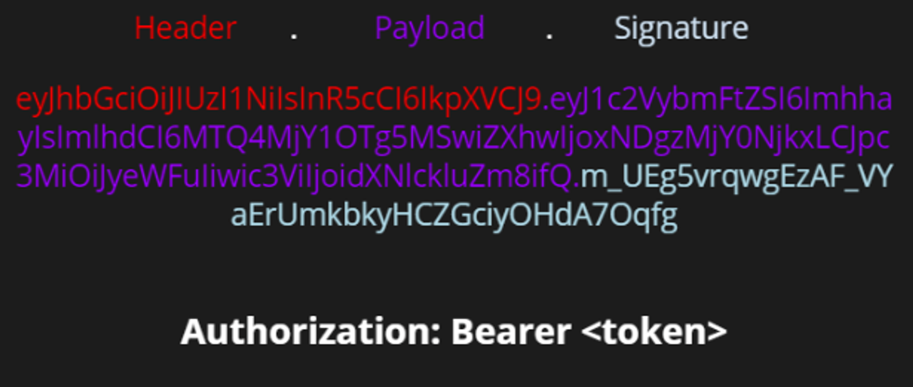
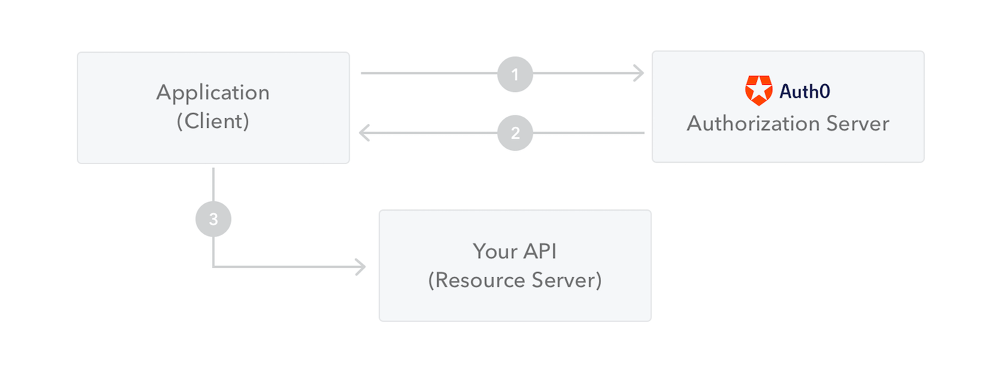

## 📍JWT

JWT 는 Json Web Token의 약자로 인증에 필요한 정보들을 암호화시킨 토큰

세션방식처럼 토큰자체를 쿠키에 담아서 보내줄 수도 있고 HTTP 헤더에 담아서 보내줄 수도 있다.

### JWT의 구조

JWT는 Header,Paylaod,Signature 3부분으로 이루어지며 **Json형태인 각 부분은 Base64로 인코딩 되어 표현된다.**
**또한 각각이 부분을 이어 주기 위해.구분자를 사용하여 구분한다.**

추가로 Base64는 암호화된 문자열이 아니고 같은 문자열에 대해 항상 같은 인코딩 문자열을 반환한다.

```java
xxxxx.yyyyy.zzzzz
```

### 1.Hearder(헤더)

토큰의 헤더는 typ와 alg 두가지 정보로 구성된다.

- typ: 토큰의 타입을 지정 ex) JWT
- alg: 알고리즘 방식을 지정하며, 서명(Signature) 및 토큰 검증에 사용 ex) HS256(SHA256) 또는 RSA

```json

{ 
 "alg": "HS256",
 "typ": JWT
 }
```

### 2.PAYLOAD(페이로드)

토큰의 페이로드에는 토큰에서 사용할 정보의 조각들인 클레임(Claim)이 담겨있다.

클레임은 총 3가지로 나누어지며 Json(Key/Value)형태로 다수의 정보를 넣을 수 있다.

Base64Url로 인코딩되어 JSON 웹 토큰의 두 번째 부분을 형성한다.

### 2.1 등록된 클레임(Registered Claim)

등록된 클레임은 토큰 정보를 표현하기 위해 이미 정해진 종류의 데이터들로 모두 선택적으로 작성이 가능하며 사용할 것을 권장
또한 JWT를 간결하게 하기 위해 key는 모두 길이 3의 String이다. 여기서 Subject로는 unique한 값을 사용하는데 사용자 이메일을 주로 사용한다.

필수는 아니지만 권장되는 미리 정의된 클레임 집합.

- iss: 토큰 발급자(issuer)
- sub: 토큰 제목(subject)
- aud: 토큰 대상자(audience)
- exp: 토큰 만료 시간(expiration), NumericDate 형식으로 되어 있어야 함 ex) 1480849147370
- nbf: 토큰 활성 날짜(not before), 이 날이 지나기 전의 토큰은 활성화되지 않음
- iat: 토큰 발급 시간(issued at), 토큰 발급 이후의 경과 시간을 알 수 있음
- jti: JWT 토큰 식별자(JWT ID), 중복 방지를 위해 사용하며, 일회용 토큰(Access Token) 등에 사용

### 2.2 공개 클레임(Public Claim)

공개 클레임은 사용자 정의 클레임으로 공개용 정보를 위해 사용된다. 충볼방지를 위해 URI포맷을 이용한다.

예시

```json
{ "https://mangkyu.tistory.com": true }

```

### 2.3 개인 클레임(Private Claim)

개인 클레임은 사용자 정의 클레임으로 서버와 클라이언트 사이에 임의로 지정한 정보를 저장
사용에 동의한 당사자 간에 정보를 공유하기 위해 생성된 사용자 정의 클레임

페이로드 예:

```json
{
  "sub": "1234567890",
  "name": "John Doe",
  "admin": true
}
```

### Signature(서명)

서명(Signature)는 토큰을 인코딩하거나 유효성 검증을할 때 사용하는 고유한 암호화 코드이다.

서명(Signature)은 위에서 만든 헤더(Header)와 페이로드(Payload)의 값을 각각 BASE64로 인코딩하고 인코딩한 값을 비밀키를 이용해 헤더(Header)에서 정의한 알고리즘으로 해싱을 하고, 이 값을 다시 BASE64로 인코딩하여 생성한다.

### **[ JWT 토큰 예시 ]**

아래의 그림은 생성된 JWT의 예시이다.



생성된 토큰은 HTTP 통신을 할 때 Authorization이라는 key의 value로 사용된다. 일반적으로 value에는 Bearer이 앞에 붙여진다.

```json
{"Authorization": "Bearer {생성된 토큰 값}",}
```

### 토큰인증 동작 방식

1. 클라이언트가 로그인 요청
2. 서버에서 유저의 고유한 ID와 다른 인증 정보들과 함께 Payload에 담는다.
3. JWT의 유효기간 설정 및 옵션을 설정해준다.
4. Secret Key를 이용해 토큰을 발급한다.
5. 발급된 토큰은 클라이언트에 쿠키 혹은 로컬 스토리지 등에 저장하여 요청을 보낼 때 마다 같이 보낸다.
6. 서버는 토큰을 Secret Key로 복호화하여 검증하는 과정을 거친다.
7. 검증이 완료되면 대응하는 데이터를 보내준다.



### **[ JWT 단점 및 고려사항 ]**

- Self-contained: 토큰 자체에 정보를 담고 있으므로 양날의 검이 될 수 있다.
- 토큰 길이: 토큰의 페이로드(Payload)에 3종류의 클레임을 저장하기 때문에, 정보가 많아질수록 토큰의 길이가 늘어나 네트워크에 부하를 줄 수 있다.
- Payload 인코딩: 페이로드(Payload) 자체는 암호화 된 것이 아니라, BASE64로 인코딩 된 것이다. 중간에 Payload를 탈취하여 디코딩하면 데이터를 볼 수 있으므로, JWE로 암호화하거나 Payload에 중요 데이터를 넣지 않아야 한다.
- Stateless: JWT는 상태를 저장하지 않기 때문에 한번 만들어지면 제어가 불가능하다. 즉, 토큰을 임의로 삭제하는 것이 불가능하므로 토큰 만료 시간을 꼭 넣어주어야 한다.
- Tore Token: 토큰은 클라이언트 측에서 관리해야 하기 때문에, 토큰을 저장해야 한다.

발급된 JWT는 삭제가 불가능하다.

세션 같은 경우에는 악의정으로 사용된다면 해당 세션을 삭제하면 된다.

토큰은 탈취당하게 되면 유효 시간이 종료되기 전까지는 탈취자가 얼마든지 악의적으로 사용이 가능하다.

그래서 Refresh Token이라는 것을 이용해 피해를 조금이라도 줄일 수 있다.

### 왜 JWT를 사용해야 할까? (**Simple Web Tokens(SWT)** 및 **Security Assertion Markup Language Tokens(SAML)과 비교)**

- JSON은 XML보다 덜 복잡하므로 인코딩될 때 크기도 더 작아 JWT가 SAML보다 더 작다.

  그러므도 HTML 및 HTTP환경에서 전달하기 좋다.


- 보안 측변에서 SWT는 HMAC알고리즘을 사용하는 shared secret에 의해서만 대칭적으로 signed(인증?) 될 수 있다.

  그러나 JWT및 SAML토큰은 public(공개)로 사용가능하다.


- JSON parsers는 많은 프로그래밍 언어에서 매핑할 수 있기 때문에 대중적이다.

  하지만 XML에는 자연스로운 매핑 방법이 없다 따라서 SAML 모다 JWT로 작업하기가 더 용이하다.

- JWT는 인터넷 규모에서 사용, 여러 플랫폼에서 사용과 처리가 용이하다.