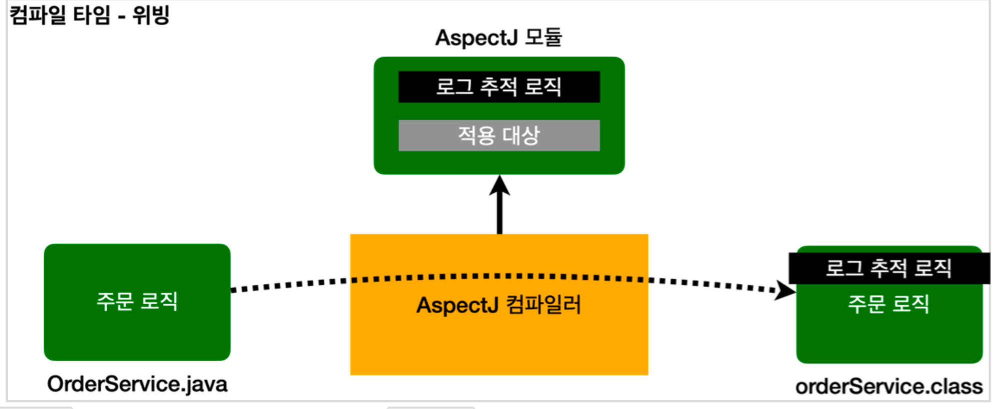
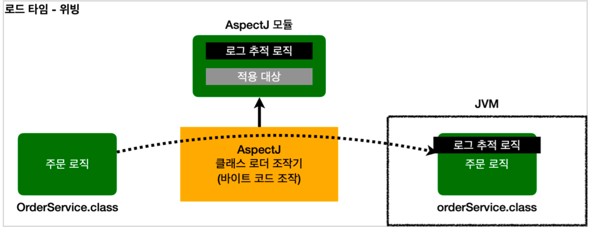
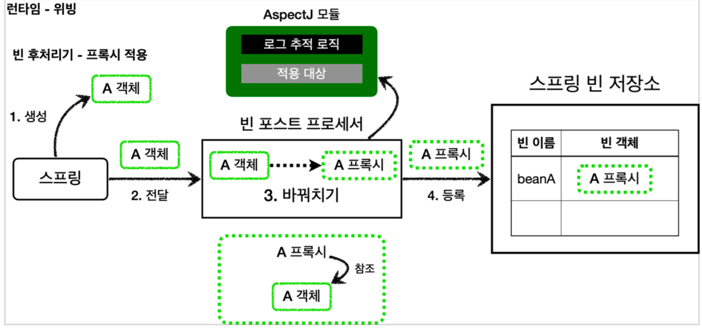
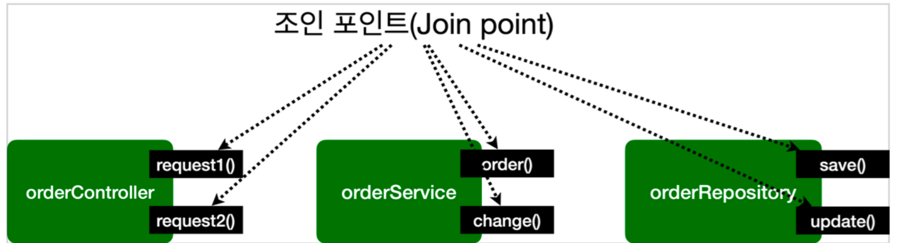
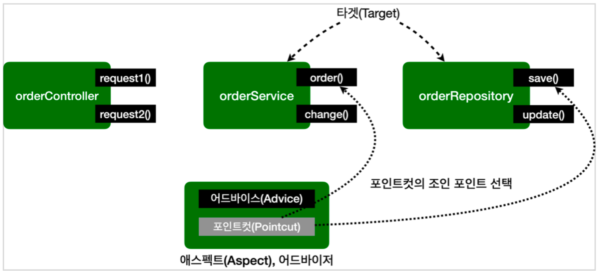

### 핵심 기능가 부가 기능

- 핵심기능

  해당 객체가 제공하는 고유의 기능

- 부가 기능

  핵심 기능을 보조하기 위해 제공되는 기능

  ex) 로그추적, 트랜잭션

### 부가 기능

보통 부가 기능은 여러 클래스에 걸쳐서 함께 사용된다.

이러한 부가 기능은 횡단 관심사(cross-cutting concerns)가 된다.

하나의 부가 기능이 여러 곳에 동일하게 사용된다는 뜻.

***************************************************부가 기능 적용문제***************************************************

- 부가 기능을 적용할 때 아주 많은 반복이 필요하다.
- 부가 기능이 여러 곳에 퍼져서 중복 코드를 만들어낸다.
- 부가 기능을 변경할 때 중복 때문에 많은 수정이 필요하다.
- 부가 기능의 적용 대상을 변경할 때 많은 수정이 필요하다.

소프트웨어 개발에서 변경 지점은 하나가 될 수 있도록 잘 모듈화 되어야 한다.

그런데 부가 기능처럼 특정 로직을 애플리케이션 전반에 적용하는 문제는 일반적인 OOP 방식으로는 해결이 어렵다.

### AOP - 애스팩트

***************************************************핵심 기능과 부가 기능을 분리***************************************************

********************************애스팩트(Aspect)********************************

- 부가 기능과 부가 기능을 어디에 적용할지 선택하는 기능을 합해서 하나의 모듈로 만든것!
- 부가 기능과, 해당 부가 기능을 어디에 적용할지 정의한 것

**************관점 지향 프로그래밍 AOP(Aspect-Oriented-Programming)**************

- 애스펙틀는 우리말로 해석하면 관점이라는 뜻
- 이름 그대로 애플리케이션을 바라보는 관점을 하나하나의 기능에서 횡단 관심사(cross-cutting concerns)관점으로 달리 보는 것.
- 애스펙트를 사용한 프로그래밍 방식
- OOP를 대체하기 위한 것이 아니라 횡단 관심사를 깔끔하게 처리하기 어려운 OOP의 부족한 부분을 보조하는 목적으로 개발되었다.

### AspectJ 프레임워크

- AOP의 대표적인 구현
- 스프링도 AOP를 지원하지만 대부분 AspectJ 문법을 차용하고, AspectJ가 제공하는 기능의 일부만 제공한다.

AspectJ 프레임워크는 스스로를 다음과 같이 설명

- 자바 프로그래밍 언어에 대한 완벽한 관점 지향 확장
- 횡단 관심사의 깔끔한 모듈화
    - 오류 검사 및 처리
    - 동기화
    - 성능 최적화(캐싱)
    - 모니터링 및 로깅

### AOP 적용 방식

AOP를 사용하면 핵심 기능과 부가 기능이 코드상 완전히 분리되어서 관리된다

AOP를 사용할떄 부가 기능 로직을 어떤 방식으로 실제 로직에 추가될까

- 컴파일 시점
- 클래스 로딩 시점
- 런타임 시점(프록시)

****************************컴파일 시점 - 위빙****************************

- .java 소스 코드를 컴파일러를 이용 .class를 만드는 시점에 부가기능 로직 추가.
- AspectJ가 제공하는 특별한 컴파일러를 사용해야함.
- 컴파일 된 .class를 디컴파일 해보면 애스펙트 관련 호출코드가 들어간다.
- AspectJ 컴파일러는 Aspect를 확인해서 해당 클래스가 적용 대상인지 먼저 확인하고, 적용대상인경우 부가 기능 로직 적용
- 원본 로직에 부가 기능 로직이 추가되는 것을 **위빙**(Weaving)이라고 한다.

******단점******

컴파일 시점에 부가 기능을 적용하려면 특별한 컴파일러도 필요하고 복잡.

****************************************클래스 로딩 시점****************************************

- 자바를 실행하면 자바 언어는 .class파일을 JVM 내부의 클래스 로더에 보관
- 이때 중간에서 .class 파일을 조작한 다음 JVM에 올릴 수 있다.
- 자바는 .class를 JVM에 저장하기 전에 조작할 수 있는 기능을 제공
- 수많은 모니터링 툴들이 이 방식을 사용
- 이 시점에 애스펙트를 적용하는 것을 **로드타임 위빙** 이라고 한다.

******단점******

자바를 실행할때 특별한 옵션(java -javaagent)를 통해 클래스 로더 조작기를 지정해야하는데 이부분이 번거롭고 운영하기 어렵다.

**런타임 시점**

- 컴파일도 다 끝나고 클래스 로더에 클래스도 다 올라가서 이미 자바가 실해오디고 난 다음
- 자바 언어가 제공하는 범위 안에서 부가 기능을 적용해야 함.
- 스프링과 같은 컨테이너의 도움을 받고 프록시와 DI, 빈프스트 프로세서 같은 개념을 총 동원해야 한다.
- 프록시 방식의 AOP

프록시를 사용하기 때문에 AOP 기능에 일부 제약이 있다.

하지만 특별한 컴파일러나, 자바를 실행할 때 복잡한 옵션과 클래스 로더 조작기를 설정하지 않아도 된다.

스프링만 있으면 얼마든지 AOP를 적용할 수 있다.

****************************************************************부가 기능이 적용되는 차이****************************************************************

- 컴파일 시점

  실제 대상 코드에 애스팩트를 통한 부가 기능 호출코드 포함, AspectJ 직접 사용

- 클래스 로딩 시점

  실제 대상 코드에 애스팩트를 통한 부가 기능 호출코드 포함, AspectJ 직접 사용

- 런타임 시점

  실제 대상 코드는 유지, 프록시를 통해 부가기능 적용, 항상 프록시를 통해야 부가 기능을 사용할 수 있다.

AOP 적용 위치

- 적용 가능 지점 (조인 포인트 Join Point, AOP를 적용 할 수 있는 지점)

  생성자, 필드 값 접근, static 메서드 접근, 메서드 실행

- AspectJ를 사용해 컴파일 시점, 클래스 로딩시점에 적용하는 AOP는 바이트코드를 실제로 조작하기 때문에 해당 기능을 모든 지점에 다 적용 가능
- 프록시 방식을사용하는 스프링 AOP는 메서드 실행 지점에만 AOP 적용 가능
- **프록시는 오버라이딩 개념으로 동작, 따라서 생성자나 static메서드, 필드 값 접근에는 적용될 수 없다**
- 프록시를 사용하는 스프링 AOP는 스프링 컨테이너가 관리할 수 있는 스프링 빈에만 AOP를 적용할 수 있다.

실무에서는 스프링이 제공하는 AOP 기능만 사용해도 대부분의 문제를 해결할 수 있다.!

### 용어 정리

************************조인 포인트(Join Point)************************

- 어드바이스가 적용될 수 있는 위치, 메소드 실행, 생성자 호출, 필드 값 접근, static 메서드 접근 같은 프로그램 실행 중 지점
- 추상적 개념, AOP를 적용할 수 있는 모든 지점
- 스프링 AOP는 프록시 방식을 사용, 조인 포인트는 항상 메소드 실행 지점으로 제한

******************포인트 컷(Point Cut)******************

- 조인 포인트 중에서 어드바이스가 적용될 위치를 선별하는 기능
- 주로 AspectJ 표현식을 사용해서 지정
- 프록시를 사용하는 스프링 AOP는 메서드 실행 지점만 포인트컷으로 선별 가능

**********타켓(Target)**********

- 어드바이스를 받는 객체, 포인트컷으로 결정

**************************************어드바이스(Advice)**************************************

- 부가 기능
- 특정 조인 포인트에서 Aspect에 의해 취해지는 조치
- Around(주변), Before(전), After(후) 와 같은 다양한 종류의 어드바이스가 있다.

********************************애스팩트(Aspect)********************************

- 어드바이스 + 포인트컷을 모듈화 한 것.
- @Aspect를 생각하면 된다.
- 여러 어드바이스와 포인트 컷이 함께 존재

******************************************어드바이저(Advisor)******************************************

- 하나의 어드바이스와 하나의 포인트 컷으로 구성
- 스프링 AOP 에서만 사용되는 특별한 용어

************************위빙(Weaving)************************

- 포인트컷으로 결정한 타켓의 조인 포인트에 어드바이스를 적용하는 것.
- 위빙을 통해 핵심 기능 코드에 영향을 주지 않고 부가 기능을 추가 할 수 있음
- AOP 적용을 위해 애스펙트를 객체에 연결한 상태
    - 컴파일 타임(AspectJ compiler)
    - 로드 타임
    - 런타임, 스프링 AOP는 런타임, 프록시 방식

********AOP 프록시********

- AOP 기능을 구현하기 위해 만든 프록시 객체, 스프링에서 AOP 프록시는 JDK 동적 프록시 또는 CGLIB 프록시