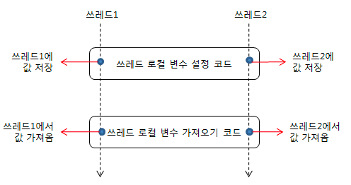

# ThreadLocal이란?

Thread 전역에서 공유되어야 하는 변수를 사용할 때

- 특정 Thread에 대한 로컬 변수를 제공한다.
- 각각의 Thread가 변수에 대해서 독립적으로 접근할 수 있다.

ThreadLocal은 한 Thread에서 실행되는 코드가 동일한 객체를 사용할 수 있도록 지원해준다.

Thread와 관련된 코드에서 파라미터를 사용하지 않고 객체를 전파하도록 할 수 있다.

heap 영역에 보관해서 공유하면 thread-safe가 무너지고

매번 stack영역에 선언하고 사용한 후 버리면 안되는 경우도 있다.

이럴때 사용하는 것이 ThreadLocal이다.



ThreadLocal 변수를 선언하면 멀티 스레드 환경에서 각 스레드마다 독립적인 변수를 가지고 get,set 메소드를 통해 값에 접근할 수 있다.

### **ThreadLocal의 활용**

ThreadLocal은 한 쓰레드에서 실행되는 코드가 동일한 객체를 사용할 수 있도록 해 주기 때문에 쓰레드와 관련된 코드에서 파라미터를 사용하지 않고 객체를 전파하기 위한 용도로 주로 사용되며,

주요 용도는 다음과 같다.

- 사용자 인증정보 전파 - Spring Security에서는 ThreadLocal을 이용해서 사용자 인증 정보를 전파한다.
- 트랜잭션 컨텍스트 전파 - 트랜잭션 매니저는 트랜잭션 컨텍스트를 전파하는 데 ThreadLocal을 사용한다.
- 쓰레드에 안전해야 하는 데이터 보관
- InheritableThreadLocal이라는 ThreadLocal을 상속받아 구현한 클래스를 사용한다면 단일 쓰레드 뿐만 아니라 그 쓰레드에서 생성한 하위 쓰레드 까지도 데이터를 공유해서 사용할 수가 있다.

### Thread 내부 구조

```java
public class Thread implements Runnable {
	//...logics
	ThreadLocal.ThreadLocalMap threadLocals = null;
}
```

Thread 클래스의 threadLocals 인스턴스 변수

```java
public class ThreadLocal<T> {
		ThreadLocalMap getMap(Thread t) {
        return t.threadLocals;
    }

    void createMap(Thread t, T firstValue) { 
        t.threadLocals = new ThreadLocalMap(this, firstValue);
    }

    public void set(T value) {
        Thread t = Thread.currentThread();
        ThreadLocalMap map = getMap(t); 
        if (map != null)                                   
             map.set(this, value);
        else
            createMap(t, value);                      
    }

    public T get() {
        Thread t = Thread.currentThread();
        ThreadLocalMap map = getMap(t);
        if (map != null) {
            ThreadLocalMap.Entry e = map.getEntry(this);
            if (e != null) {
                @SuppressWarnings("unchecked")
                T result = (T)e.value;
                return result;
            }
        }
        return setInitialValue();
    }

    public void remove() {
        ThreadLocalMap m = getMap(Thread.currentThread());
        if (m != null)
            m.remove(this);
   }

	static class ThreadLocalMap {
		static class Entry extends WeakReference<ThreadLocal<?>> {
            /** The value associated with this ThreadLocal. */
            Object value;

            Entry(ThreadLocal<?> k, Object v) {
                super(k);
                value = v;
            }
        }
	}
}
```

Thread 객체는 threadLocals 인스턴스 변수를 가지고 있다.

이 인스턴스 변수를 이용해 ThreadLocal 내부의 ThreadLocalMap이라는 클래스를 통해 key/value 형식으로 데이터를 보관한다.

그렇기 때문에 ThreadLocal의 데이터를 참조할때 currentThread() 메소드를 통해 현재 Thread를 꺼내와 Thread내부의 ThreadLocalMap을 가져와 활요한다.

### **ThreadLocal 사용시 주의 사항**

쓰레드 풀 환경에서 ThreadLocal을 사용하는 경우 ThreadLocal 변수에 보관된 데이터의 사용이 끝나면 반드시 해당 데이터를 삭제해 주어야 한다.

그렇지 않을 경우 재사용되는 쓰레드가 올바르지 않은 데이터를 참조할 수 있다.

예를 들면 ThrreadLocal 객체를 이용해 set() 메서드로 현재 쓰레드의 로컬 변수에 값을 저장한 후, get() 메서드를 이용해 로컬 변수 값을 읽어 왔다고 가정했을때,

데이터의 사용이 끝나면 ThreadLocal.remove() 메서드를 이용해서 현재 쓰레드의 로컬 변수 값을 반드시 삭제해줘야 한다.