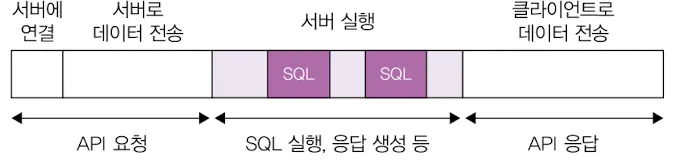
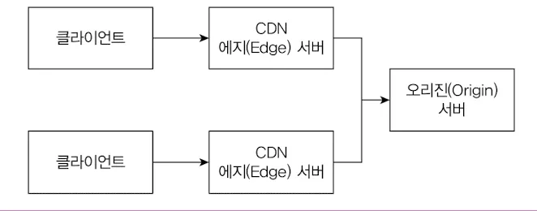

## 처리량과 응답 시간

### 사용자가 무언가 실행할 때 동작 하기 까지 걸린시간 ( 성능 지표 )

사용자는 무언가 실행할때 동작까지 걸린 시간으로 성능을 판단하지만 실제로 다양한 지표가 관련이 있다.

- 네트워크 속도
- 디스크 속도
- 메모리 크기
- 디바이스(스마트폰) CPU 속도

이런 다양한 지표 중 서버성능과 관련있는 중요한 지표는 응답시간과 처리량 이다.

### 응답 시간

응답 시간은 사용자의 요청을 처리하는데 걸리는 시간.

**하나의 API요청을 처리하는데 걸리는 전체 시간**

**클라이언트(앱이나 브라우저)가 서버로 요청을 보내는 과정은 크게 2단계로 이루어진다.**

1. 서버에 연결 : TCP를 이용해 서버에 연결
2. 데이터 전송 : 정해진 규칙(프로토콜)에 따라 데이터를 서버에 전송, 예를들어 HTTP 프로토콜에 따라 POST 방식으로 JSON 데이터를 보낼 수 있다.

### 응답시간

응답 시간 지표

- TTFB
    - Time to First Byte
    - 응답 데이터 중 첫 번째 바이트가 도착할 때까지 걸린 시간
- TTLB
    - 응답 데이터의 마지막 바이트가 도착할 때 까지 걸린 시간

### 응답 시간의 중요성

구글이 공개한 ‘Speed Matters for Google Web Search 에 따르면 검색 지연 시간이 길어질수록 사용자당 검색 횟수가 줄어드는 경향이 확인

100ms 지연 시 : 검색 횟수 0.2% 감소

400ms 지연 시 : 검색 횟수 0.6% 감소

응답 시간이 증가하면 트래픽과 매출이 줄어든다.

응답 시간을 줄인다고 해서 매출이 반드시 증가하는 것은 아니지만 서비스에 부정적인 영향을 주는 것은 확실하다.

### 응답 시간에서 가장 큰 비중을 차지하는 것들

응답 시간은 아래과 같이 구성

- API 요청 전송 시간
- 서버의 처리 시간
    - 로직 수행
    - DB 연동
    - 외부 API 연동
    - 응답 데이터 생성
- API 응답 전송 시간

**DB 연동과 외부 API 연동이 큰 비중을 차지한다.**

## 처리량

**처리량의 단위**

단위 시간당 시스템이 처리하는 작업량을 의미하는데 흔히 TPS나 RPS로 처리량을 나타낸다.

- TPS (transaction per second)
- RPS (request per second)

**응답 시간의 증가를 방지하는 방법**

- 서버가 동시에 처리할 수 있는 요청 수를 늘려 대기 시간 줄이기
- 처리 시간 자체를 줄여 대기 시간 줄이기

**응답 시간(성능)을 개선 방법**

- 현재 서버의 TPS와 응답 시간을 파악
- 목표 TPS와 응답시간 설정
- TPS를 확인하기 위해 모니터링 시스템을 활용해라

### 서버 성능 개선 기초

### **성능 문제의 증상**

- 순간적으로 모든 사용자 요청에 대한 응답 시간이 심각하게 느려진다.
  10초 이상 걸리는 요청이 늘어나고 다수의 요청에서 연결 시간 초과와 같은 오류가 발생한다.
- 서버를 재시작하면 잠시 괜찮다가 다시 응답시간이 느려지는 현상이 반복된다.
- 트래픽이 줄어들 때까지 심각한 상황이 계속된다.

### **병목지점 식별**

- TPS를 높이려면 성능 문제가 발생하는 병목지점을 찾아야 한다.
- 코드를 추측할 수 도 있지만 실제 실행 시간 추적 기능을 제공하는 모니터링 시스템을 활용해라
- 모니터링 모두가 없다면 로그라도 남겨야 한다
- 일반적인 서버는 DB나 다른 API와 연동한다, 성능 문제는 주로 DB나 외부 API를 연동하는 과정에서 발생했다.

### **수직 확장과 수평 확장**

**수직 확장**

- CPU, 메모리, 디스크등의 자원을 증가
- 클라우드 환경에서 비교적 빠르게 시도할 수 있는 방법
- 수직 확장은 즉각적인 효과를 바로 얻을 수 있지만 트래픽이 지속해서 증가하면 언젠가 결국 또다시 성능 문제가 발생한다.
- 수직 확장은 비용이 많이들고, 한 대의 장비가 감당할 수 있는 용량에도 한계가 있다.

**수평 확장**

- 서버를 추가로 투입해 TPS를 높이는 방법
- 무턱대고 서버를 추가해서는 안됨
    - DB에서 성능 문제가 발생하고 있는데 서버를 추가로 투입하면 상황이 더 악화될 수 있다.
- 외부 API의 성능이 개선되지 않는 한 서버를 추가한다고 해도 TPS는 향상되지 않는다.
- DB나 외부 성능에 문제가 발생하지 않는 범위 내에서만 수평 확장을 해야 효과가 있다.

### DB 커넥션 풀

- 네트워크에서 DB를 연결하고 종료하는 시간은 전체 응답 시간에 영향을 줌.
- 매 요청마다 DB를 연결하고 종료하면 트래픽이 증가할 때 급격하게 처리량이 떨어지기도 한다.
- DB 커넥션 풀은 DB에 연결된 커넥션을 미리 생성해서 보관
- DB 작업이 필요할 때 풀에서 커넥션을 가져와 사용하고 작업이 끝나면 다시 풀에 반환한다.
- 커넥션 풀을 사용하면 이미 연결된 커넥션을 재사용 하기 때문에 응답 시간이 줄어드는 장점이 있다.

**커넥션 풀의 중요 설정**

- 커넥션 풀 크기(또는 최소 크기, 최대 크기)
- 풀에 커넥션이 없을 때 커넥션을 구할 때까지 대기 시간
- 커넥션의 유지 시간(최대 유휴 시간, 최대 유지 시간)

**커넥션 풀 크기의 영향**

- 커넥션 풀 크기는 커넥션 풀에 미리 생성해둘 커넥션 개수를 지정하는 설정
- 서버는 주로 DB와 통신하기 때문에 DB 연결을 관리하는 DB 커넥션 풀 크기를 잘 못 설정하면 성능에 큰영향을 준다.

**풀에서 커넥션을 얻기 위해 대기하는 시간을 줄이려면 전체 응답 시간과 TPS를 고려하여 커넥션 풀 크기를 지정해야 한다.**

- 풀의 모든 커넥션이 사용중이라면 다른 요청은 풀에 유휴 커넥션이 생길 때 까지 대기한다.

> 트래픽이 순간적으로 급증하는 패턴을 보인다면 커넥션 풀의 최소 크기를 최대 크기에 맞추는 것이 좋다.
트래픽이 점진적으로 증가할 때는 DB 연결 시간이 성능에 큰 영향을 주지 않지만 트래픽이 급증할 경우 DB 연결 시간도 성능 저하의 주요 원인이 될 수 있다.
>

**커넥션 풀 크기 증가는 DB 서버의 CPU 사용률을 고려해야 한다.**

- DB 커넥션 CPU 사용률이 80%에 육박하는 상황에서 커넥션 풀 크기를 늘리면 DB에 가해지는 부하가 더 커져 쿼리 실행 시간이 급격히 증가할 수 있다.
- 이러한 상태에서는 커넥션 풀 크기를 늘리기보다 오히려 커넥션 풀 크기를 유지하거나 줄여서 DB 서버가 포화 상태에 이르지 않도록 해야 한다.
- DB 서버의 상태를 면밀히 확인 후 수평 확장을 진행해야 한다.

**커넥션 대기 시간**

- 대기 시간이란 풀에 사용할 수 있는 커넥션이 없을 때 커넥션을 얻기 위해 기다릴 수 있는 최대시간을 의미

**커넥션 대기 시간을 어떻게 설정할까?**

대기 시간을 짧게 설정하면 커넥션 풀이 모두 사용중 일때 빠르게 일시적 오류와 같은 에러 응답을 사용자에게 보여줄 수 있다.

**에러를 보여주는것이 부정적이지는 않을까?**

대기 시간 때문에 긴 시간 동안 무응답 상태로 유지되는 것보다 빠르게 에러를 반환하는 것이 더 낫다.

또한 빠르게 에러를 응답해야 서버의 부하가 증가하는 것도 방지 할 수 있다.

대기 시간을 짧게 설정하면 서버 부하를 일정 수준으로 유지할 수 있으며 서버를 안정적으로 운영하는 데 도움이 된다.

### 최대 유휴시간 유효성 검사, 최대 유지 시간

**최대 유휴 시간**

- 사용되지 않는 커넥션을 풀에 유지할 수 있는 최대 시간을 의미
- 이 시간을 DB에 설정된 비활성화 유지 시간보다 짧게 설정하면 DB가 연결을 끊기 전에 풀에서 커넥션을 제거할 수 있다.

**유효성 검사**

- 커넥션이 정상적으로 사용할 수 있는 상태인지 여부를 확인하는 절차
- 커넥션 풀의 구현 방식에 따라 커넥션을 풀에서 가져올 때 유효성을 검사하거나 주기적으로 검사할 수 있다.
- 연결이 유효하지 않은 커넥션을 식별하고 풀에서 제거할 수 있다.

**최대 유지 시간**

- 생성 시점부터 정해진 시간만큼 유지되고 지나면 커넥션이 유효하더라고 커넥션을 닫고 풀에서 제거된다.

> 최대 유휴 시간과 초대 유지 시간을 무한대로 설정하지 않는 것이 좋다.
커넥션 풀의 기본값을 확인한 뒤 이 두설정의 기본값이 무제한으로 되어 있다면 DB 설정을 참고하여 적절한 값으로 지정해야 한다.
>

### 서버 캐시

**캐시는 왜 필요할까?**

- 응답 시간을 줄이고 처리량을 높이기 위해 DB 서버를 수직 확장하거나 수평 확장할 수 있다.
- 하지만 DB 서버를 확장하려면 비용이 증가.
- DB 서버를 수평 확장하더라고 처리량은 늘릴 수 있지만 실행 시간이 획기적으로 줄어들지 않는다.

**캐시**

- 캐시에 데이터를 저장해두면 동일한 데이터를 요청할 때 DB가 아닌 캐시에서 데이터를 읽어와 응답할 수 있다.
- 캐시에서 데이터를 읽는 속도가 DB보다 빠르기 때문에 자주 조회되는 데이터를 캐시에 보관하면 응답 시간을 줄일 수 있다.

**캐시 동작**

1. 캐시에서 키에 해당하는 값을 조회한다.
2. 값이 존재하면 바로 사용
3. 존재하지 않을 경우 DB에서 먼저 값을 조회한 후 해당 값을 캐시에 저장하고 사용한다.
4. DB 뿐만이 아닌 복잡한 계산 결과나 외부 API 연동 결과도 캐시에 보관하여 응답 시간을 줄이는 데 활용할 수 있다.

**적중률과 삭제 규칙**

**적중률**

캐시에 존재한 건수/캐시에서 조회를 시도한 건수

적중률을 높히려면 최대한 많은 정보를 캐싱해 놓을 수 있지만 메모리자원을 사용하기 때문에 무작정 저장할 수는 없다.

캐시에 보관할 수 있는 데이터에 제한이 있으므로 새로운 데이터를 저장하려면 기존에 있던 데이터중 하나를 제거해야 한다.

LRU(Least Recently Used) : 가장 오래전에 사용된 데이터를 제거한다.

LFU(Least Frequently Used) : 가장 적게 사용된 데이터를 제거한다.

FIRO(First In First Out) : 먼저 추가된 데이터를 먼저 삭제한다.

캐싱에는 유효시간 (만료시간)을 설정하는 방식도 함께 사용해 메모리를 효율적으로 관리할 수 있다.

**로컬 캐시와 리모트 캐시**

**로컬 캐시**

서버 프로세스와 동일한 메모키를 캐시 저장소로 사용

- 캐시에 저장할 수 있는 데이터 크기에 제한이 있다.
    - 서버 프로세스가 사용할 수 있는 메모리양에 물리적인 한계가 있기 때문
- 서버 프로세스를 재시작하면 메모리에 존재하던 캐시 데이터가 모두 삭제되어 일시적으로 캐시 효율(적중률)이 순간적으로 떨어진다는 단점도 있다.

데이터 규모가 작고 변경 빈도가 매우 낮다면 로컬 캐시로 충분

**리모트 캐시**

별도 프로세스를 캐시 저장소로 사용

- 캐시 크기를 유연하게 확장할 수 있다.
- 서버 프로세스가 재시작되더라도 저장된 캐시 데이터는 그대로 유지된다.
- 리모트 캐시의 단점은 속도
    - 서버는 캐시와 데이터를 주고받기 위해 네트워크 통신을 해야한다.
- 별도의 서버 장비와 프로세스가 필요하기 때문에 시스템 구조가 복잡해진다.

데이터 규모가 크다면 , 배포 빈도가 높은 서비스라면 리모트 캐시 사용을 적극적으로 고려

**캐시  선택**

로컬 캐시와 리모트 캐시는 각각 장단점이 뚜렷하기 때문에 상황이나 용도에 맞게 선택해야 한다.

데이터 규모, 변경 빈도, 응답시간, 처리량 등을 판단 기준으로 삼아 결정해야 한다.

**캐시 사전 적재**

트래픽이 순간적으로 급증하는 패턴을 보인다면 캐시에 데이터를 미리 저장하는 것도 고려할 필요가 있다.

특정 시점에 트래픽이 급증한다면 캐시에 데이터가 저장되어 있지 않기때문에 캐시 적중률이 떨어져 응답 시간이 느려질 뿐만 아니라 DB에 전달되는 부하도 급격히 증가한다.

특정 이벤트나 순간적으로 몰릴 경우가 예상된다면 캐시 데이터를 미리 넣어두어 응답 시간을 안정적으로 유지할 수 있드며, DB에 부하가 집중되는 현상도 효과적으로 방지 할 수 있다.

**캐시 무효화**

- 캐시를 사용할 때 반드시 신경 써야 할 점은 유효하지 않은 데이터를 적절한 시점에 캐시에서 삭제하는 것.
- 캐시에 보관된 데이터의 원본이 바뀌면, 그에 맞춰 캐시에 보관된 데이터도 함께 변경하거나 삭제해야 한다.
- 변경에 민감한 데이터는 로컬 캐시가 아닌 리모트 캐시에 보관해야 한다.
  로컬 캐시는 자신의 데이터만 변경하지 다른 서버의 로컬 캐시는 변경하지 않기 때문이다.
- 변경에 민감하지 않고 데이터 크기가 작다면 캐시의 유효 시간을 설정하여 주기적으로 갱신하는 방식을 사용해도 된다.

**가비지 컬렉터와 메모리**

- 가비지 컬렉터를 사용하는 언어는 사용이 끝난 객체를 힙 메모리에서 바로 삭제하지 않고 정해진 규칙에 따라 사용 하지 않는 메모리를 찾아서 반환한다.
- 힙 메모리 사용량이 일정 비율 초과하면 가비지 컬렉터를 실행하거나, 일정 주기로 자동 실행된다.
- 메모리를 많이 사용하고 생성된 객체가 많을수록 사용하지 않는 객체를 찾는데 시간이 오래 걸린다
- 반대로 메모리 사용을 줄이면 GC 시간도 줄어들 가능성이 높아진다.

**한번에 대량으로 객체를 생성하는 것을 주의해야한다.**

- 많은 사용자가 동시요청으로 사용할 수 있는 최대 메모리를 초과한다면 GC를 실행하짐나 메모리가 부족한 상태는 지속된다.
- 대량으로 객체가 생성되는 것을 방지하려면 조회 범위를 제한해야 한다.
- 한 번에 조회할 수 있는 데이터의 개수도 트래픽 규모와 메모리 크기에 맞춰 제한해야 한다.

**파일 데이터**

- 파일 데이터를 한꺼번에 메모리에 로딩한 후에 응답하는 방식은 파일 크기와 동시 사용자 수에 따라 메모리 사용량이 급증할 수 있기 때문에 피해야 한다.
- 파일 다운로드와 같은 기능을 구현할 때는 스트림을 활용한다.

**응답 데이터 압축**

- 응답 시간에는 데이터 전송 시간이 포함된다 전송 시간은 2가지 요인에 영향을 받음
    - 네트워크 속도
    - 전송 데이터 크기
- 서버는 사용자의 네트워크 속도를 제어할 수 없지만 전송하는 데이터의 크기는 제어할 수 있다 이때 사용할 수 있는 방법이 응답 데이터를 압축하는 것.
- 텍스트 데이터를 gzip으로 압축하면 70%이상 크기를 줄일 수 있다.
- 전송 크기가 줄어든 만큼 전송 시간도 빨라진다. 즉, 응답 시간이 짧아진다.
- 응답 데이터를 압축하는 것은 비용에도 영향을 준다, 클라우드 환경에서는 트래픽 자체가 비용으로 직결되기 때문이다.
- Nginx와 같은 웹 서버는 압축 기능을 제공해 약간의 설정마나 추가하면 즉시 효과를 볼 수 있다.

**정적 자원과 브라우저 캐시**

- 정적 자원은 전체 트래픽에서 상당한 비중을 차지
- 매번 다운로드하면 서버 입장에서 좋을 게 없다, 트래픽은 비용과 연결된다.
- 클라이언트 캐시를 활용해  HTTP 프로토콜에서 데이터를 응답할 때 Cache-Control에나 Expires 헤더를 이용해 클라이언트가 응답 데이터를 일정 시간 동안 저장해둘 수 있도록 설정할 수 있다.

**정적 자원과 CDN**

- 브라우저 캐시는 브라우저 단위로 동작하기 때문에 많은 사용자가 접속하면 순간적으로 많은 양의 이미지, JS, CSS를 전송하게 된다. 때문에 네트워크가 포화되어 응답 시간이 급격히 느려짐.
- 문제를 해결하기 위해 CDN(Content Delivery Network)를 사용할 수 있다.

**CDN**

- 콘텐츠를 제공하기 위현 별도의 네트워크를 의미
- 이미지, js 같은 정적 자원을 CDN으로 제공하면 오리진 서버가 처리해야 할 트래픽을 상당히 줄일 수 있다.
- CDN은 여러 지역에 서버를 둔다. 때문에 사용자는 가까운 곳에 위치한 서버에 연결해서 콘텐츠를 다운로드 하여 콘텐츠를 더 빠르게 받을 수 있다.
- 또한 오리진 서버에서 직접 콘텐츠를 제공하는 것보다 트래픽 비용도 적게 든다.

이미지와 같은 파일을 업로드할 때 파일 크기를 신중하게 관리해야 한다.

- 비용청구가 올라가거나
- 특정 트래픽을 초과하지 못하게 막는 경우도 있어 서비스가 불능 상태에 빠지기도 한다.
- 웹 서버에 크기 제한 설정을 추가해 일정 크기를 초과하면 에러 코드를 응답하도록 설정하여 네트워크가 포화되거나 트래픽 비용이 과도하게 증가하는 것을 방지할 수 있다.

**대기 처리**

- 사용자가 순간적으로 폭증할 때가 있다.
    - 대표적인 예가 콘서트 예매
- 방법중 하나는 서버를 미리 증설하는것, 하지만 서버를 증설한다고 문제는 끝나는 것이 아님, DB 성능도 문제가 된다.
    - 서버는 다시 줄일 수 있지만 DB는 그렇지 않다.
- 시스템의 처리량을 무작정 늘리기 보다 수용할 수 있는 수준의 트래픽만 받아들이고 나머지는 대기 처리하는 것.
    - 서버를 증설하지 않고도 서비스를 안정적으로 제공할 수 있다.
    - 사용자의 지속적인 새로 고침으로 인한 트래픽 폭증도 방지할 수 있다.