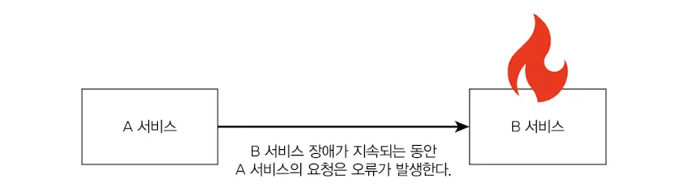
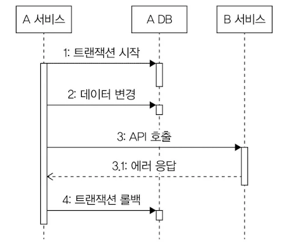

## 우리는 문제가 없는데

- 마이크로 서비스를 도입하는 기업이 늘면서 내부 서비스간 연동도 복잡해지고 있다.
  서비스 간 연동은 계속 증가하는 추세, 그만큼 신경써야 할 품질 문제도 함께 늘고 있다.
- 연동하는 서비스에 장애가 발생하면 우리 서비스도 영향을 받는다.

## 타임아웃

- 연동 서비스를 호출할 때 타임아웃을 적절히 설정하지 않으면 연동 서비스에 장애가 발생했을 때 전체 서비스의 품질이 급격히 나빠질 수 있다.
- 연동 서비스에 대한 타임아웃을 설정하지 않으면 연동 서비스의 응답이 느릴 때 처리량이 급격히 떨어진다.
    - 사용자는 응답이 올 때까지 기다리지 않음
        - 새로고침 같은 방법으로 새로운 요청을 보내게됨 → 문제 악화
- 사용자가 타임아웃 에러 화면을 볼 수도 있지만 반응 없는 무한 대기보다는 에러 화면이라도 보는 것이 더 낫다.
- 서버는 사용자 요청에 대해 (스레드 풀 같은) 자원이 포화되기 전에 응답하게 되므로, 연동 서비스 문제가 다른 기능에 주는 영향을 줄일 수 있다.

### 연결 타임아웃, 읽기 타임아웃

- 연결에 시간이 오래 걸리면 대기 시간도 함께 증가한다.
- 대기 시간이 무한정 길어지면 성능 문제가 발생하므로, 연결 타임아웃을 설정해 연결 대기 시간을 제한 해야 한다.

**처음 연동하는 서비스라면 타임아웃 시간을 아래와 같이 설정한 뒤, 후이를 보면서 조정하는 것이 좋다.**

- 연결 타임아웃 3초~5초
- 읽기 타임아웃 5초~30초

**소켓 타임아웃과 읽기 타임아웃**

- 읽기 타임아웃을 지정할 때 실제 설정하는 값이 무엇인지 확인해야 함.
    - e.g.) Apache HttpClient → 소켓타임아웃
- 소켓 타임아웃은 네트워크 패킷 단위를 기준으로 하므로 전체 응답 시간에 대한 타임아웃을 의미하지는 않음
- 소켓 타임아웃을 5초로, 호출 타임아웃을 10초로 설정하면 패킷은 계속 수신되지만 전체 처리 시간이 오래 걸리는 경우에 타임아웃을 발생시킬 수 있다.

## 재시도

- 외부 연동에 실패했을 때 처리 방법 중 하나는 재시도를 하는 것.
- 네트워크 통신 과정에서 연결에 실패하거나 일시적으로 응답이 느려지는 경우 재시도를 통해 연동 실패를 성공으로 바꿀 수 있다.

### 재시도 가능 조건

- 항상 재시도를 할 수 있는 것은 아님, 연동 API를 다시 호출해도 되는 조건인지 확인 해야 함.

**재시도를 해도 되는 조건**

- 단순 조회 기능
- 연결 타임아웃
- 멱등성을 가진 변경기능

- 상태를 변경하는 연동 API를 재시도할 때는 멱등성을 고려해야 한다.
- 같은 API라도 실패 원인에 따라 재시도 여부를 결정해야 한다.
    - id값을 빈값으로 전달했을 경우 재시도를 해도 같은 이유로 실패한다.

**재시도 횟수**

재시도를 무한정 할 수는 없다

재시도 횟수만큼 응답 시간도 함께 증가하기 때문이다.

대부분 1~2 정도의 재시도가 적당.

**재시도 간격**

- 재시도 간격도 중요
- 실패 이후 바로 재시도할 경우 같은 네트워크 문제로 인해 다시 연결 타임아웃이 발생할 수 있다.
- 여러 차례 재시도할 경우 재시도 간격을 점진적으로 늘리기도 함.
    - 첫 번째 재시도 1초, 두 번째 재시도는 2초

**재시도 폭풍 안티패턴**

- 재시도를 통해 성공 가능성을 높일 수 있지만 연동 서비스에는 더 큰 부하를 줄 수 있다.
- 연동 서비스의 성능이 느려져서 읽기 타임아웃이 발생한 경우 재시도는 연동 서비스의 성능을 더 나쁘게 할 수 있다.
- 재시도를 검토할 대는 연동 서비스의 성능 상황도 함께 고려해야 한다.

# 동시 요청 제한

- 연동서비스가 느려지면 우리 서비스도 함께 느려진다.
- 순간적으로 트래픽이 몰릴 때 발생할 수 있고 트래픽이 연동 서비스로 그대로 전달되면, 연쇄적으로 응답 시간이 느려지는 사오항이 발생 할 수 있다.
- 연동 서비스에 임계치 이상의 요청을 보내면서 발생하는 성능 저하 문제를 완화하는 방법은 연동 서비스에 요청을 일정 수준 이상으로 보내지 않는것.

**벌크헤드 패턴**

- 각 구성 요소를 격리함으로써 한 구성요소의 장애가 다른 구성 요소에 영향을 주지 않도록 하는 설계 패턴
- 동시요청 100개를 처리할 수 있을 때
    - 300개가 요청이 들어온다면 100개는 처리되고 200개는 바로 에러 처리.
    - 연동 기능은 오류가 발생하지만 영동하지 않는 나머지 기능은 정상 동작할 수 있다.

# 서킷 브레이커

- B 서비스가 정상 상태가 아닐 때, A 서비스에서 B 서비스에 요청을 보내지 않고 바로 에러를 응답하는 것.
    - B 서비스의 문제가 A 서비스에 주는 영향(응답 시간 증가, 처리량 감소)를 줄일 수 있다.
- 서킷 브레이커는 과도한 오류가 발생하면 연동을 중지 시키고 바로 에러를 응답한다.
- 닫힘, 열림, 반열림 상태를 가짐
    - 닫힘 상태로 시작한다.
        - 닫힘 상태는 모든 요청을 연동 서비스에 전달
    - 오류가 발생하기 시작하면 지정한 임계치를 초과했는지 확인 초과했다면 열림 상태가 된다.
        - 시간 기준 오류 발생 비율 : 예) 10초동안 오류 비율이 50% 초과
        - 개수 기준 오류 발생 비율 : 예) 100개 요청 중 오류 비율이 50% 초과
    - 열림 상태가 되면 연동 요청은 수행하지 않음, 바로 에러 응답 리턴
        - 열림 상태는 지정된 시간동안 유지
    - 일정 시간이 지나면 반 열림 상태로 전환
        - 연동에 성공하면 닫힘 상태로 복귀
        - 연동 실패시 다시 열림 상태로 전환되어 연동 차단

### 빠른실패

- 실패를 빠르게 감지하고, 문제가 있는 기능을 실행하지 않고 중단시키는 방식
- 장애가 발생한 기능에 부하가 더해지는 것을 방지할 뿐 아니라, 불필요한 자원 낭비를 줄여 전체 서비스의 안정성을 유지하는 데도 도움이 된다.

# 외부 연동과 DB 연동

DB 연동과 외부 연동을 함께 실행할 때는 발생할 수 있는 2가지 상황

### 외부 연동에 실패했을 때 트랜잭션 롤백

**읽기 타임아웃이 발생해 트랜잭션을 롤백할 때는 외부 서비스가 실제로는 성공적으로 처리했을 가능성을 염두에 두어야 함.**

1. 일정 주기로 두 시스템의 데이터가 일치하는지 확인하고 보정하는 방법
2. 성공 확인 API를 호출하는 방식
    1. 읽기 타임아웃이 발생한 경우, 일정 시간 후에 이전 호출이 실제로 성공했는지 확인하는 API를 호출한다.

### 외부 연동은 성공했지만 DB 연동에 실패해 트랜잭션을 롤백

- 취소 API를 호출해 외부 연동을 이전 상태로 되돌리는 것이 필요.
- 취소 API가 없거나 취소에 실패 할 수도 있기 때문에 데이터 일관성이 중요한 서비스라면 일정 주기로 데이터가 맞는지 비교하는 프로세스를 갖추는 것이 좋다.

### 외부 연동이 느려질 때 DB 커넥션 풀 문제

**DB 트랜잭션 범위 안에서 외부 연동을 수행할 때 외부 연동이 느려지면서 커넥션 풀 부족 현상이 발생 할 수 있다.**

- 외부 연동 응답이 지연되면서 DB 쿼리를 사용하지 않아도 커넥션이 점유된 상태가 지속되는것.

**DB 연동과 무관하게 외부 연동을 실행할 수 있다면, DB 커넥션을 사용하기 전이나 후에 외부 연동을 시도하는 방안도 고려해볼 수 있다.**

- 외부 연동이 트랜잭션 범위 밖에서 실행 되기 떄문에 롤백이 불가능
    - 이 경우 실패한 외부 연동에 대한 후처리를 반드시 고민해야 한다.
- 후처리에는 보상트랜잭션, 데이터를 후보정 하는 방법 등이 있다.

# HTTP 커넥션 풀

HTTP 연결도 커넥션 풀을 사용하면 연결 시간을 줄일 수 있어 응답 속도 향상에 도움이 된다.

## **HTTP 커넥션 풀을 사용할 때 고려할 점**

### HTTP 커넥션 풀의 크기

- 풀의 크기는 연동할 서비스의 성능에 따라 결정해야함.
- 무턱대고 커넥션 풀 크기를 늘리면 순간적으로 트래픽이 몰릴 때 연동 서비스의 응답시간이 급격히 느려질 수 있다.
- 연동 서비스의 성능 저하가 우리 서비스 전체의 응답시간 까지 느리게 만들 수 있음.

### 풀에서 HTTP 커넥션을 가져올 때까지 대기하는 시간

- 대기 시간이 길어지면 전체 응답 시간도 함께 늘어나므로 대기 시간은 수 초 이내의 짧은 시간으로 설정하는 것이 좋다.
- 너무 짧은 경우 일시적인 트래픽 증가에도 커넥션을 구하지 못해 에러가 발생할 수 있다

### HTTP 커넥션을 유지할 시간(keep alive)

- 커넥션은 무한정 유지되지 않음
- 연동 서비스가 일정 시간 동안 커넥션을 유지한 뒤 연결을 끊는 경우도 있음.
- 끊어진 커넥션을 사용하면 에러가 발생하므로 연동 서비스에 맞춰 유지 시간을 적절히 설정해야 한다.

# 연동 서비스 이중화

서비스가 대량 트래픽을 처리할 만큼 성장했다면 연동 서비스의 이중화를 고려해야 한다.

이중화하면 연동할 서비스가 늘어나고 그만큼 개발과 유지에 드는 비용도 증가한다.

### 언제 연동 서비스를 이중화 해야할까?

- 해당 기능이 서비스의 핵심인지 여부
- 이중화 비용이 감당 가능한 수준인지
- 재정적으로 이중화를 감당할 수 있어야 한다.
    - 연동서비스 장애로 인한 손실보다 이중화에 드는 비용이 더 크다면 이중화를 결정하기는 쉽지 않을 것.