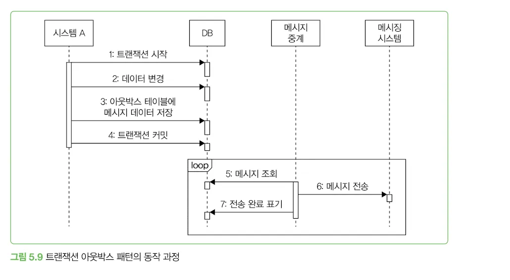

# 비동기 연동

## 동기 방식

- 순차적으로 실행
- 한 작업이 끝날 때까지 다음 작업이 진행되지 않는다.
- 흐름을 직관적으로 이해할 수 있고 디버깅도 용이하다.
- 외부 연동을 만나면 고려할 점이 있다.

### 동기 방식에서 외부연동을 만나면 고려할 점

- 외부 연동 실패가 전체 기능의 실패인지 확인해야 한다.
- 외부 서비스의 응답 시간도 고려해야 한다.
    - 연동 서비스의 응답 시간이 길어질 수록 전체 응답 시간이 느려지게 된다.
- 다음 작업을 진행하기 위해 반드시 외부 연동 결과가 필요한 게 아니라면, 동기 방식 대신 비동기 방식으로 연동하는 것을 고민해 볼 필요가 있다.

## 비동기 방식

- 한 작업이 끝날 때까지 기다리지 않고 바로 다음 작업을 처리.

### 비동기 방식을 사용해도 크게 문제가 되지않는 공통적인 특징

1. 연동에 약간의 시차가 생겨도 문제가 되지 않는다.
2. 일부 기능은 실패했을 때 재시도가 가능하다.
3. 연동에 실패했을 때 나중에 수동으로 처리할 수 있는 기능도 있다.
4. 연동에 실패했을 때 무시해도 되는 기능도 있다.

### 비동기 연동의 구현방식

1. 별도 스레드로 실행하기
2. 메시징 시스템 이용하기
3. 트랜잭션 아웃박스 패턴 사용하기
4. 배치로 연동하기
5. CDC 이용하기

# 별도 스레드를 이용한 비동기 연동

- 비동기 연동을 하는 가장 쉬운 방법은 별도의 스레드로 실행하는 것.
- 스프링에서는 @Async 애노테이션을 이용한 비동기 실행 기능을 제공한다.
- 비동기로 실행되는 메서드는 익셉션이 전파되지 않기 때문에 오류 처리에 더 신경 써야 한다.
    - 별도 스레드로 실행되는 코드는 내부에서 연동 과정에서 발생한 오류를 직접 처리해야 한다.

### 스레드와 메모리

- 스레드는 자체적으로 일정 크기의 메모리를 사용
- 스레드풀을 자용하면 스레드를 일정 개수로 유지할 수 있어 메모리 사용량도 일정하게 유지됨.
- 미리 스레드를 생성하기 때문에 스레드를 생성하는 시간도 단축된다.
    - 풀에 생성된 스레드보다 더 많은 작업을 동시에 수행하려면 일부 작업은 다른 작업이 끝날 때 까지 대기해야 한다.
- 비동기로 실행할 코드가 외부 API 호출이나 DB 연동과 같은 네트워크 IO 작업이라면 자바의 가상 스레드나 Go언어의 고루틴, Kotlin의 코루틴을 사용하는 것도 방법
    - 실제 네이티브 스레드(OS 스레드)가 아닌 런타임에서 관리하는 경량 스레드로 적은 메모리를 사용
    - 메모리가 적은 만큼 한번에 만들 수 있는 스레드 개수도 많다.

# 메시징을 이용한 비동기 연동

서로 다른 시스템 간에 비동기로 연동할 때 주로 사용하는 방식은 메시징 시스템을 사용하는 것.

## 메시징 시스템의 이점

### 두 시스템이 서로 영향을 주지 않는다.

- 메시징 시스템은 중간에서 메시지를 보관하는 버퍼 역할을 함.
- 시스템 A의 트래픽이 급증하더라고 시스템 B는 자신의 용량에 맞게 메시지를 처리할 수 있다.
- 시스템 B의 성능이 저하되더라도 시스템A 는 영향을 받지 않고 메시지는 메시징 시템을 통해 전송됨.

### 확장이 용이하다.

- 메시징 시스템을 사용하면 새로운 시스템을 메시징 시스템에 연결하기만 하면 된다.
    - 코드 수정이 불필요하다.

### 메시징 시스템 용도로 많이 사용되는 기술

**카프카**

- 높은 처리량을 자랑한다.
- 초당 백 만 개 이상의 메시지를 처리할 수 있다.
- 수평 확장이 용이하다.
    - 서버(브로커), 파티션, 소비자를 늘리면 된다.
- 카프카는 메시지를 파일에 보관해서 메시지가 유실되지 않는다.
- 1개의 토픽이 여러 파티션을 가질 수 있는데, 파티션 단위로 순서를 보장한다.
    - 하지만 토픽 수준에서는 순서를 보장할 수 없다.
- 소비자는 메시지를 언제든지 재처리할 수 있다. 풀(pull) 모델을 사용한다.
    - 소비자가 카프카 브로커에서 메시지를 읽어 가는 방식이다.

**래빗MQ**

- 클러스터를 통해 처리량을 높일 수 있다. 단, 카프카보다 더 많은 자원을 필요로 한다.
- 메모리에만 메시지를 보관하는 큐 설정을 사용하면 장애 상황 시 메시지가 유실될 수 있다.
- 메시지는 큐에 등록된 순서대로 소비자에 전송된다.
- 메시지가 소비자에 전달됐는지 확인하는 기능을 제공한다.
- 푸시push 모델을 사용한다. 래빗MQ 브로커가 소비자에 메시지를 전송한다. 소비자의 성능이 느려지면 큐에 과부하가 걸려 전반적으로 성능 저하가 발생할 수 있다.
- 다재 다능하다. AMQP, STOMP 등 여러 프로토콜을 지원하고, 게시/구독 패턴뿐만 아니라 요청/응답, 점대점point-to-point 패턴을 지원한다.
    - 또한 우선순위를 지정해서 처리 순서를 변경할 수도 있다.

**레디스 pub/sub**

- 메모리를 사용하므로 지연 시간이 짧고, 래빗MQ 대부 처리량이 높다.
- 구독자가 없으면 메시지가 유실된다.
- 기본적으로 영구 메시지를 지원하지 않는다.
- 모델이 단순해서 사용하기 쉽다.

## 메시지 생성 측 고려사항

메시지를 생성할 때 고려할 점은 메시지 유실에 대한 것.

### 오류처리를 위해 선택할 수 있는 방법

**무시한다.**

- 이 경우 메시지가 유실됨
- 메시지의 용도에 따라 유실이 일부 허용될 수 있다.
    - 단순 로그
    - 메시지 전달

**재시도**

- 일시적인 네트워크 불안정과 같은 오류는 재시도를 통해 해결될 수 있음
- 메시지 전송을 재시도 하는 과정에서 중복된 메시지가 전송될 수 있다.
    - 메시징 시스템이 중복 수신을 방지하는 기능을 제공하지 않으면 메시지 소비자가 중복 메시지를 알맞게 처리해야 한다.
- 메시지마다 고유 식별자를 사용하면 메시지 소비자가 중복 메시지 여부를 판단하는데 도움이 된다.

**실패 로그 남기기**

- 로그는 나중에 후처리를 하는데 사용
- 실패 로그는 후처리에 필요한 데이터를 담고 있어야 함.

### DB 트랜잭션과의 연동 고려

DB 트랜잭션에 실패했는데 메시지가 발송되면 잘못된 데이터가 전달될 수 있기 때문이다.

**DB 변경에 실패하여 트랜잭션 롤백했지만 메시지는 트랜잭션 롤백 전 메시징 시스템으로 전송**

잘못된 메시지가 전송되는 문제를 방지하려면 트랜잭션이 종료된 이후 메시지를 전송해야 한다.

### 글로벌 트랜잭션과 메시지 연동

- 여러 DB를 하나의 트랜잭션으로 묶어서 처리할 수 있다.
- 2PC라고 표현하기도 함.
- 글로벌 트랜잭션을 지원하는 메시징 시스템도 존재
    - activeMQ
    - 모든 메시징 시스템이 글로벌 트랜잭션을 지원하는 것은 아님
- 글로벌 트랜잭션을 사용하면 성능에 영향이 있음
    - 2단계 커밋을 처리하는 과정이 추가되면서 처리 속도가 느려짐.
    - 커밋 과정이 길어지면서 동시에 처리할 수 있는 요청이 줄어들게 됨.
        - 글로벌 트랜잭션이 반드시 필요한 상황이 아니라면 DB 처리와 메시지 연동을 묶지 말자.

## 메시지 소비 측 고려 사항

### 중복 메시지 처리 - 메시지 생산자가 같은 데이터를 가진 메시지를 메시징 시스템에 두 번 전송

**고유한 ID를 부여해서 이미 처리했는지 여부를 추적하는 것.**

- 메시지 처리 여부는 DB에 기록하거나 메모리에 집합 으로 관리하면 된다.
- 메모리로 관리할 때는 메모리 부족 에러가 발생하는 것을 막기 위해 일정 개수의 메시지 ID만 유지

### 중복 메시지 처리 - 소비자가 메시지를 처리하는 과정에서 오류가 발생해 메시지 재수신

- 멱등성을 갖도록 API를 구현
- 메시지를 잘 소비하고 있는지 모니터링해야 한다.

## 메시지 종류: 이벤트와 커맨드

메시지에는 크게 2가지 종류

- 이벤트
- 컨맨드

### 이벤트

- 어떤 일이 발생했음을 알려주는 메시지.
- 상태 변경과 관련이 있음
- 이벤트 메시지는 정해진 수신자가 없다.
- 소비자 확장에 적합

### 커맨드

- 무언가를 요청하는 메시지
- 커맨드 메시지를 수신하는 소비자는 메시지로 요구한 기능을 실행한다.
- 메시지를 수신할 측의 기능 실행에 초점이 맞춰져 있다.
- 수신자가 정해져 있음.

### 궁극적 일관성

- 두 데이터 저장소 간의 일관성을 보장하긴 하지만 즉시가 아닌 일정 시간이 지난 후에야 일관성이 맞춰진다는 특징을 가진다.
- 두 저장소 간에 데이터 불일치가 발생할 수 있다.

# 트랜잭션 아웃박스 패턴

## 트랜잭션 아웃박스 패턴의 핵심

- 메시지 자체가 유실되지 않도록 보장하기위해 해당 데이터를 DB에 안전하게 저장.
- 저장된 메시지를 읽어 메시징 시스템에 전송
- 메시지를 DB에 저장하는 방식이 트랜잭션 아웃박스 패턴

## 트랜잭션 아웃박스 패턴 동작 과정

1. 하나의 DB 트랜잭션내에서 2가지 작업 수행
    - 실제 업무 로직에 필요한 DB 변경 작업을 수행
    - 메시지 데이터를 아웃박스 테이블에 추가

2. 아웃박스 테이블에 쌓인 메시지 데이터는 별도의 메시지 중계 프로세스가 주기적으로 읽어서 메시징 시스템에 전송
    1. DB 트랜잭션 범위에서 아웃박스 테이블에 메시지 데이터를 추가하므로 메시지 데이터가 유실되지 않음.
    2. 트랜잭션을 롤백하면 메시지 데이터도 함께 롤백되므로 잘못된 메시지 데이터가 전송될 일도 없다.

1. 발송 완료 표시
    1. 아웃박스 테이블에 발송 상태 컬럼을 두는 방식
        1. 3가지 상태를 가짐 (발송 대기, 발송 완료, 발송 실패)
        2. 발송 대기를 가지는 데이터를 조회하고 발송에 성공하면 발송완료로 변경
    2. 메시지 중계 서비스가 성공적으로 전송한 마지막 메시지 ID를 별도로 기록하는 방식
        1. 파일이나 별도의 테이블에 메시지 ID를 저장해두고 다음번 대기 메시지를 조회할 때 이 ID이후의 메시지만 선택하는 것.

**발송 완료 표시 방식 선택**

**아웃박스 테이블에 발송 상태 컬럼을 두는 방식**

- 모니터링이 쉬움

**마지막 메시지 ID를 기록하는 방식**

- 2개 이상의 메시지 중계 서비스가 하나의 아웃박스 테이블을 함께 사용하는 환경이라면 각 중계 서비스가 고유하게 마지막 메시지 ID를 관리해야 하므로, 이경우 마지막 메시지 ID를 기록하는 방식이 더 적합.

# 배치 전송

- 배치 전송은 데이터를 비동기로 연동하는 가장 전통적인 방법
- 배치는 일정간격으로 데이터를 전송
    - 결제 승인 데이터를 모아서 다음 날 보내거나
    - 택배 발송 요청 데이터를 1시간 간격으로 보내는 식

### 배치로 전송하는 전형적인 실행 과정

1. DB에서 전송할 데이터를 조회한다.
2. 조회한 결과를 파일로 기록한다.
3. 파일을 연동 시스템에 전송한다.

### 배치 전송에 사용하는 파일 형식

파일 전송은 FTP나 SFTP같은 파일 전송 프로토콜 혹은 SCP와 같은 명령어를 이용해 수행한다.

**주로 사용하는 파일 형식**

- 값1(구분자)값2(구분자)값3(구분자)값4
    - 각 값을 특정 문자를 이용해 구분하는 방식
    - 형식이 단순해 구현이 간단하고 파싱속도도 빨라서 널리사용
- 이름1=값1 이름2=값2 이름3=값3 이름4=값4
    - 이름이 포함되어 있어 위치에 관계없이 어떤 값인지 알 수 있다는 장점이 있다.
    - 이름까지 포함되므로 첫 번째 형식에 비해 데이터 크기는 더 커짐
- JSON 문자열
    - 대부분의 프로그래밍 언어는 JSON 변환 기능을 제공, 쉽게 구현할 수 있다.
    - JSON 형식은 값 외에도 프로퍼티 이름, 형식을 지키기위한 콤마, 큰따옴표, 콜론 문자를 포함하므로 데이터 크기가 커진다.

### 재처리 기능 만들기

파일을 지정한 시간에 전송하지 못할 때가 있다.

어떤 이유에서든 전송에 실패하면 일정 시간 후에 재전송 하는 기능을 구현하자.

수동으로 배치를 쉽게 실행할 수 있도록 명령어나 API를 만들면 문제가 생겼을 때 빠르고 편하게 배치를 재실행 할 수 있다.

# CDC (Change Data Capture)

DBMS가 데이터가 변경되면 그 변경 내용을 통지하는 기능을 제공하는 것.

### CDC의 데이터 전파

1. 변경된 데이터를 CDC 처리기에 전송
    1. 커밋된 데이터만 변경된 순서에 맞게 전달됨
    2. 변경 데이터는 레코드 단위로 전달
2. CDC 처리기는 전달받은 변경 데이터를 확인하고 가공한 뒤에 대상 시스템에 전파
    1. 변경 데이터를 그대로 대상 시스템에 전파
        1. 두 시스템의 데이터가 1대1의 관계를 가질 때 적합.
        2. 예) 회원 시스템의 회원 데이터를 컨텐츠 시스템의 회원 테이블에 동기화하는 상황
    2. 변경 데이터를 가공/변환해서 대상 시스템에 전파

### CDC의 사용 목적

목적에 따라 CDC처리기는 DB, 메시징 시스템, API 등 다양한 대상에 데이터를 전파할 수 있음

- 두 시스템 간 데이터 동기화가 목적일때 DB와 DB 사이에 CDC를 두어 데이터를 복제할 수 있다.
- 메시징 시스템에 데이터를 전파하면 여러 시스템에 변경된 데이터를 전달할 수 있어 확장에 유리하다.

**CDC와 데이터 위치**

- CDC는 변경 데이터를 어디까지 처리했는지 기록해야 함.
- CDC 처리기를 재시작할 때 마지막으로 조회한 로그부터 읽어올 수 있어야한다.

**CDC가 유용할 때**

- 연동 코드를 넣기 부담스러울 경우
- 이미 코드가 복잡해 연동 코드를 추가하기 어렵거나 일정에 여유가 없을 경우

> 모든 연동을 비동기로 구현할 필요는 없다!
비동기로 구현했을 때 발생하는 복잡도 증가보다 얻는 이점이 더 크다면 비동기 연동을 고려해보자.
>