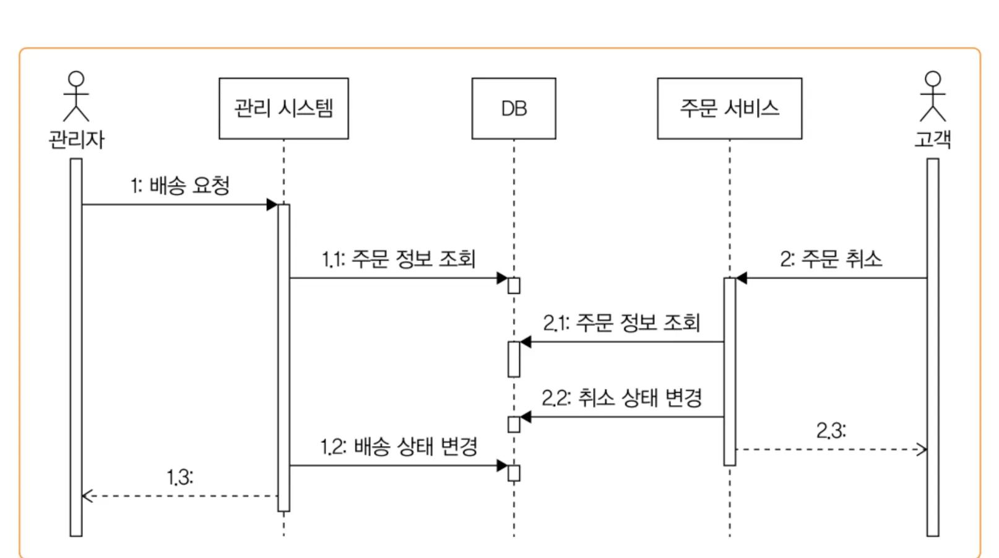

# 서버와 동시 실행

- 동시에 여러 클라이언트가 요청을 보내기 때문에, 서버는 각 요청을 동시에 처리해야 한다.
- 동시에 처리하지 못하고 각 요청을 순차적으로 처리한다면 서버의 전체적인 성능, 즉 처리량과 응답 시간이 나빠진다.

### 서버가 동시에 여러 클라이언트의 요청을 처리하는 방식

- 클라이언트 요청마다 스레드를 할당하여 처리
- 비동기 IO(또는 논블로킹IO)를 사용해서 처리

**어떤 방식을 사용하든 서버는 동시 실행이 기본이다.**

> 경쟁 상태
여러 스레드가 동시에 공유 자원에 접근할 때, 접근 순서에 따라 결과가 달라지는 상황
>

# 잘못된 데이터 공유로 인한 문제 예시

- **인스턴스가 하나뿐인 싱글톤 객체에 존재하는 변수에 여러 스레드가 데이터를 공유하여 접근하여 결과값이 잘못되는 문제**
- DB의 데이터를 동시에 변경할 때 발생
    - 서로 동일한 시점에 조회하여 값을 변경했을 경우

# 프로세스 수준에서의 동시 접근 제어

## 잠금(lock)을 이용한 접근 제어

잠금을 사용하면 공유 자원에 접근하는 스레드를 한 번에 하나로 제한할 수 있다.

흐름

1. 잠금 획득
2. 공유자원에 접근(임계영역)
3. 잠금을 해제함

잠금은 한 번에 한 스레드만 획득 가능

동시에 여러 스레드가 잠금 획득을 시도할 경우 하나만 획득하고 나머지 스레드는 잠금이 해제될 때까지 대기

잠금을 획득한 스레드는 공유자원에 접근한 뒤 사용을 마치면 잠금을 해제

**임계영역**

- 동시에 둘 이상의 스레드나 프로세스가 접근하면 안 되는 공유 자원에 접근하는 코드 영역
- 메모리, 파일이 해당

### synchronized와 ReentrantLock

synchronized 키워드를 사용하여 스레드의 동시 접근을 제어할 수 있다.

블록이 모두 수행되면 자동으로 잠금을 해제 unlock() 과 같은 메서드를 호출할 필요가 없음

RenntrantLock은 synchronized에 존재하지 않는 기능을 제공

잠금 획득 대기 시간

어느 방식을 사용해도 문제는 없다. 하지만 섞어서 사용하지말고 가능하면 한 가지 방식으로 통일하자.

## 동시 접근 제어를 위한 구성 요소

### 세마포어

- 동시에 실행할 수 있는 스레드 수를 제한
- 자원에 대한 접근을 일정 수준으로 제한하고 싶을 때 세마포어를 사용할 수 있다.
- 세마포어는 허용 가능한 숫자를 이용해서 생성
    - 이 숫자를 자바 세마포어 구현체는 퍼밋 이라고 표현
- 이진 세마포어와 계수 세마포어가 존재
    - 이진 세마포어는 동시에 접근할 수 있는 스레드가 1개
    - 계수 세마포어는 지정한 수만큼 동시 접근이 가능

**세마포어를 사용하는 전형적인 순서**

1. 세마포어에서 퍼밋 획득(허용 가능한 숫자 1 감소)
2. 코드 실행
3. 서마포어에 퍼밋 반환(허용 가능한 숫자 1 증가)

**잠금의 문제**

- 잠금을 사용하면 데이터를 변경하지 않더라도 동시에 읽기가 안된다.
- 한 번에 1개 스레드만 읽기 기능을 실행할 수 있기 때문
- 한 번에 한 스레드만 읽기가 가능하므로 쓰기 빈도 대비 읽기 빈도가 높을 때에는 읽기 성능이 떨어지는 문제가 발생할 수 있다.

**읽기 쓰기 잠금**

읽기 쓰기 잠금을 사용하면 단점을 없애면서 잠금을 통해 데이터 동싱 접근 문제를 없을 수 있다.

- 쓰기 잠금을 한 번에 한 스레드만 구할 수 있다.
- 읽기 잠금은 한 번에 여러 스레드가 구할 수 있다.
- 한 스레드가 쓰기 잠금을 획득했다면 쓰기 잠금이 해제될 때 까지 읽기 잠금을 구할 수 없다.
- 읽기 잠금을 획득한 모드 스레드가 읽기 잠금을 해제할 때까지 쓰기 잠금을 구할 수 없다.

쓰기동안 읽기를 할 수 없고, 읽는 동안 쓰기를 할 수 없다.

또한 동시에 여러 스레드가 읽기를 실행할 수 있다.

따라서 읽기 쓰기 잠금을 사용하면 잠금을 사용했을 때 발생하는 읽기 성능 문제를 완화할 수 있다.

### 원자적 타입(Atomic Type)

**잠금의 문제**

- 잠금을 사용하면 카운터 증가에 대한 동시성 문제를 간단하게 해결할 수 있지만 CPU 효율이 떨어진다는 단점이 있다.
    - 여러 스레드가 실행할 때 잠금을 확보한 스레드를 제외한 나머지 스레드는 대기하기 때문
- 잠금을 사용하지 않으면서 동시성 문제없이 카운터를 구현하는 방법은 바로 원자적 타입을 사용하는 것.
    - Atomic은 내부적으로 CAS 연산을 사용 때문에 스레드를 멈추지 않고도 다중 스레드 환경에서 안전하게 값을 변경할 수 있다.

**CAS**

- Compare And Swap의 약자로 이름 그대로 비교 후에 교체하는 연산을 말함.

### 동시성 지원 컬렉션

- 스레드에 안전하지 않은 컬렉션을 여러 스레드가 공유하면 동시성 문제가 발생할 수 있음.
- 문제를 해결하기 위해 동기화된 컬렉션을 사용하는 것.
    - 데이터를 변경하는 모든 연산에 잠금을 적용해서 한 번에 한 스레드만 접근할 수 있도록 제한하는 것.

**불변 값**

- 동시성 문제를 피하기 위한 방법 중 하나는 불변 값을 사용하는 것.
- 값이 바뀌지 않기 때문에 동시에 여러 스레드가 접근해도 문제가 발생하지 않는다.
- 불변 값은 데이터 변경이 필요한 경우, 기존 값을 수정하는 대신 새로운 값을 생성해서 사용하자.

# DB와 동시성

- DB 트랜잭션만으로는 모든 동시성 문제를 해결할 수는 없다.
- DB 데이터를 동시에 수정할 때 발생하는 문제도 있다.
    - 프로세스 수준에 잠금을 사용한 것처럼 DB에 맞는 잠금 기능을 활용해야 한다
- DB는 명시적으로 잠금 기법을 제공
    - 선점 잠금 또는 비관적 잠근 이라고 부름
    - 선점 잠금을 사용하면 동일한 레코드에 대해 한 번에 하나의 트랜잭션만 접근할 수 있도록 제어
    - 비선점 잠금은 값을 비교해서 수정하는 방식, 쿼리 실행 자체는 막지 않으면서도 데이터가 잘못 변경되는 것을 막을 수 있음.

## 선점(비관적) 잠금

- 선점 잠금은 데이터에 먼저 접근한 트랜잭션이 잠금을 획득하는 방식
- 한 트랜잭션이 특정 레코드에 대한 잠금을 획득한 경우, 잠금을 해제할 때까지 다른 트랜잭션은 동일 레코드에 대한 잠금을 획득하지 못하고 대기해야 함.
- 레코드에 대한 잠금은 트랜잭션이 종료될 때 반환

**분산잠금**

- 여러 프로세스가 동시에 동일한 자원에 접근하지 못하도록 막는 방법
- 분산잠금은 여러 프로세스 간에 잠금 처리를 한다는 점에서 차이가 있다.
- 간단한 분산 잠금은 선점 잠금을 사용
- 트래픽이 많다면 레디스를 이용해 분산 잠금을 구현하는것을 고려

## 비선점(낙관점 잠금)

- 명시적으로 잠금을 사용하지 않음.
- 데이터를 조회한 시점의 값과 수정한 시점의 값이 같은지 비교하는 방시긍로 동시성 문제를 처리
- 비선점 잠금은 잠금을 구하기 위한 대기 과정이 없기 때문에 실패할 경우 사용자에게 더 빠르게 결과를 응답할 수 있다는 장점이 있다.

## 외부 연동과 잠금

- 트랜잭션 범위 내에서 외부 시스템과 연동해야 한다면 선점 잠금을 고려하는것이 좋다.
    - 결제는 이미 취소됐는데, 데이터 변경에 실패해서 트랜잭션이 롤백되는 경우.
- 비선점 잠금을 사용하고 싶다면 트랜잭션 아웃박스 패턴을 적용해서 외부 연동을 처리하는 방법도 있다.

## 증분 쿼리

- 잠금을 사용하지 않으면서 수를 증가시키는 방법
    - joinCount = joinCount + 1
    - 위 연산을 원자적 연산으로 처리
- DB는 동일 데이터에 대한 원자적 연산이 동시에 실행될 경우 순차적으로 실행, 따라서 데이터가 누락되는 문제가 발생하지 않음.

# 잠금 사용시 주의사항

## 잠금 해제하기

- 잠금을 획득한 뒤에는 반드시 잠금을 해제해야 한다.
- 해제하지 않으면 잠금을 시도하는 스레드가 무한정 대기하게 된다.

## 대시기간 지정하기

- 잠금 획득을 시도하는 코드는 잠금을 구할 수 있을 때 까지 계속 대기, 동시 접근이 많아지면 대기 시간이 길어지는 문제가 발생할 수 있다.
- 대기 시간이 길어지는 문제를 막기위한 방법중 하나로 대기 시간을 지정하는 것

## 교착상태 피하기

- 한 작업에서 2개 이상의 자원의 잠금을 획득하는 코드 구조는 교착상태에 빠지기 쉬운 전형적인 패턴
- 교착 상태를 해소할 수 있는 방법 중 하나는 잠금 대시 시간을 제한하는 것.
- 교착 상태 발생을 줄이는 다른 방법은 지정한 순서대로 잠금을 획득하는 것.
    - 예를들어 정렬순서 기준으로 잠금을 시도.

# 단일 스레드로 처리하기

### **동시성 문제가 발생하는 주된 이유**

- 여러 스레드가 동시에 동일 자원에 접근하기 때문

### 골치를 앓지 않으면서 동시성 문제를 피하는 방법

- 한 스레드만 자원에 접근하는 방식을 사용하면 된다.
- 여러 스레드가 동시에 접근하지 않고 한 스레드만 접근하므로 해초에 동시성 문제가 발생하지 않게 된다.

### 불변값 공유

- 두 스레드가 데이터 공유가 필요하면 콜백이나 큐와 같은 수단을 사용해서 데이터 복제본을 공유한다.
- 복제본 대신 불변값을 공유하기도 한다.
- 복제본이나 불변 값을 공유하는 이유는 다른 스레드에서 데이터를 수정하지 못하게 해서 동시성 문제가 발생하는 것을 막기 위함이다.

### 단일 스레드로 처리했을때 고려할점

- 단일 스레드로 처리하면 동시성문제에서 자유로울수 있지만 구조는 복잡해지는 단점이 있음.
- 논블로킹이나 비동기 IO를 사용하는 경우에는 블로킹 연산을 취소화해야 하므로 단일 스레드 처리 방식이 적합하다.

### 단일 스레드사용에서 성능

- 성능은 동시에 실행할 작업 개수와 임계영역의 실행 시간에 따라 달라짐
- 임계영역의 시간이 짧고 동시에 접근하는 스레드 수가 적을수록 잠금을 사용하는 구현의 성능이 좋을 가능성이 높다.
    - 큐나 채널을 처리하는데 드는 시간보다 잠금 획득과 해제에 드는 시간이 더 짧기 때문이다.
- 반면에 동시에 실행되는 작업이 많고 임계영역의 실행 시간이 길어진다면 큐나 채널을 이용한 방식이 비슷하거나 더 나은 성능을 낼 가능성도 있다.